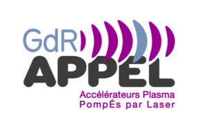
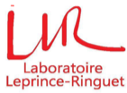
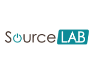
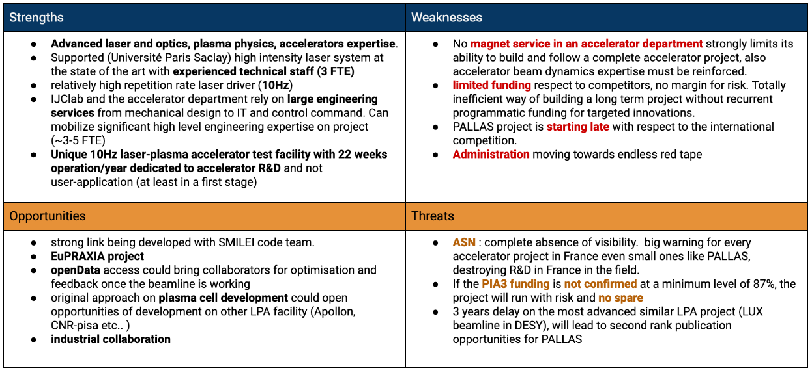

```{r setup, include = FALSE}
library(knitr)
library(tidyverse)
library(nhsrtheme)
library(xaringanExtra)
# set default options
opts_chunk$set(echo = FALSE,
               fig.width = 7.252,
               fig.height = 4,
               dpi = 300)
xaringanExtra::use_panelset()
xaringanExtra::use_clipboard()
xaringanExtra::use_webcam()
xaringanExtra::use_broadcast()
xaringanExtra::use_share_again()
xaringanExtra::style_share_again(share_buttons = c("twitter", "linkedin", "pocket"))
# uncomment the following lines if you want to use the NHS-R theme colours by default
# scale_fill_continuous <- partial(scale_fill_nhs, discrete = FALSE)
# scale_fill_discrete <- partial(scale_fill_nhs, discrete = TRUE)
# scale_colour_continuous <- partial(scale_colour_nhs, discrete = FALSE)
# scale_colour_discrete <- partial(scale_colour_nhs, discrete = TRUE)
```

```{r metathis, echo=FALSE}
library(metathis)
meta() %>%
  meta_name("github-repo" = "https://github.com/kevinCassou/slides") %>% 
  meta_social(
    title = "PALLAS PROJECT",
    description = paste(
      "laser-plasma accelerator test falicility @ IN2P3"
    ),
    url = "https://build-your-own-universe.netlify.app",
    image = "https://build-your-own-universe.netlify.app/social-card.png",
    image_alt = paste(
      "CNRS/IN2P3/Université Paris-Saclay; IJClab:", 
      "Scale high-quality research data provisioning with R packages,", 
      "presented at Conseil Scientifique IN2P3 2021/02/09 by K. Cassou"
    ),
    og_type = "website",
    og_author = "CNRS/IN2P3/IJClab",
    twitter_card_type = "summary_large_image",
    twitter_creator = "@Cassoukevin",
    twitter_site = "@IJClab"
  )
```

layout: true 

<div class="my-header"></div>

<div class="my-footer">
<span>
 &emsp;
 &emsp; 

| &emsp; CS-IN2P3 &emsp; | &emsp; accelerator &emsp; | &emsp; 2021/02/09 &emsp;  |
&emsp;&emsp;&emsp;&emsp;&emsp;&emsp;&emsp;&emsp;&emsp;&emsp;&emsp;&emsp;&emsp;
&emsp;&emsp;&emsp;&emsp;&emsp;&emsp;&emsp;&emsp;&emsp;&emsp;&emsp;&emsp;
 </span></div>


---
class: title-slide, left, bottom

# `r rmarkdown::metadata$title`
----
## .blue[**`r rmarkdown::metadata$subtitle`**]
### `r rmarkdown::metadata$author`
### `r rmarkdown::metadata$date`

---
class: center, middle

## on behalf ot the team 


---
class: inverse, center, middle

# Laser wakefield acceleration

---
name:bubble

# in a bubble 

some basics
.pull-left[

```{r echo = FALSE, fig.pos="h", out.width="90%"}

```

]

.pull-right[
laser driver :

$$F_p = -m_e c^2 \nabla (a^2/2)$$
$$a = eE_L/ m_e\omega_L c$$
non linear regime $a>1$, in 1D, plasma wakefield, density pertubation: s 

$$\frac{\delta n}{ n_0} =\frac{1}{2} \left[ \frac{1+a^2}{(1+\phi)^2}-1\right]$$
]

.pull-left[

.green[**+**] High accelerating field, $E_0 = 96\sqrt{n_0}\,\,[V/m]$ <sup>1</sup>

.green[**+**] ultra short bunches, $\sim10$fs  <sup>2</sup>
]

.pull-right[

.red[-] tiny transient structure  $\sim10\mu$m

.red[-] hard to control $\rightarrow$ large fluctuation

]

.footnote[
[1] E. Esarey, *et al.* (2009), [doi: 10.1103/RevModPhys.81.1229](https://doi.org/10.1103/RevModPhys.81.1229)

[2] O. Lundh, *et al.* (2011),[doi: 10.1038/s41598-020-73805-7](http://www.nature.com/articles/s41598-020-73805-7)
]


---
name: injection
# Injection ... 

so many way to surf the plasma wake waves... when increasing the laser driver intensity (.orange[a<sub>0</sub>]): 

.panelset[
.panel[.panel-name[external]
.pull-left[
.left[
.orange[a<sub>0</sub> ~1 ]

**+** linear regime control acceleration

**-** requires a RF linac

**-** coupling to the plasma wake 
focusing / timing

* very low charge $\sim20$ fC <sup>1 </sup>
* timing constraints $\sim\lambda_p/c$ 
</br>
</br>
</br>
</br>
.tiny[
[1] [ B. Marchetti et al.,NIMA  vol. 829, pp. 278–283, Sep. 2016](https://doi.org/10.1016/j.nima.2016.03.041) </br>
[2] [Y. Wu et al. arXiv (2020)](https://arxiv.org/ftp/arxiv/papers/2005/2005.00183.pdf)
]
]

]


.pull-right[

```{r echo=FALSE, out.width="100%"}

```

]

] <!---->


.panel[.panel-name[ionization]
.pull-left[
.left[
.orange[a<sub>0</sub> >2]

**+** Use k-shell of high-Z gas «electron born»  in the right place <sup>1</sup> 
and weakly nonlinear

**-** easy injection leading to broad spectrum<sup>2</sup>

but evolution of the method using unmatched<sup>3</sup> laser conditions 

**>** Self truncated ionization injection (STII)<sup>4</sup>


.tiny[
[1] [M. Chen et al.  Physics of Plasmas, vol. 19, no. 3, p. 033101, Mar. 2012,](https://doi.org/10.1063/1.3689922)
<br>
[2] [C. E. Clayton et al., Phys. Rev. Lett., vol. 105, no. 10, p. 105003, Sep. 2010](https://doi.org10.1103/PhysRevLett.105.105003).
<br>
[3] [W. Lu et al., Phys. Rev. ST Accel. Beams, vol. 10, no. 6, p. 061301, Jun. 2007](https://doi.org/10.1103/PhysRevSTAB.10.061301).
<br>
[4] [A. Irman et al., Plasma Phys. Control. Fusion, vol. 60, no. 4, p. 044015, Apr.](https://doi/10.1088/1361-6587/aaaef1)

]
]

]

.pull-right[

```{r echo=FALSE, out.width="65%"}

```

]
] <!---->

.panel[.panel-name[density down-ramp]
.pull-left[
.left[
.orange[a<sub>0</sub> >3]

**+** slow down the wake <sup>1</sup>

**+** localized injection 

**+** high charge <sup>2</sup>, high quality beam <sup>3</sup>

**-** gradient stability / charge energy coupled

</br>
</br>

.tiny[
[1] [H. Ekerfelt, et al., Sci Rep, vol. 7, no. 1, p. 12229, Dec. 2017](https:/doi.org/10.1038/s41598-017-12560-8)<br>
[2] [J. Götzfried et al., Phys. Rev. X, vol. 10, no. 4, p. 041015, Oct. 2020](https://link.aps.org/doi/10.1103/PhysRevX.10.041015)<br>
[3] [H.-E. Tsai et al., Physics of Plasmas, vol. 25, no. 4, p. 043107, Apr. 2018](https://doi.org/10.1063/1.5023694)


]

]]
.pull-right[

```{r echo=FALSE, out.width="110%"}
knitr::include_graphics("img/density_down-ramp.svg")
```

]
]

.panel[.panel-name[self-injection]
.pull-left[
.left[
.orange[a<sub>0</sub> >4]

**+** easy to implement drive wake into breaking

**-** very high laser laser intensity

**-** difficult to control
<br>
<br>
<br>
<br>
<br>
.tiny[
[1] Pukhov, A. & Meyer-ter Vehn, J.  Appl. Phys. B 74, 355–361 (2002)
<br>
[2] Faure *et al.*, Geddes *et al.*, Mangles *et al.* in Nature 431 (2004)
]

]]

.pull-right[
```{r echo=FALSE, out.width="100%"}
knitr::include_graphics("img/bubble_regime.svg")
```
]
]

]<!---->

---
name: lpaexp
# typical laser plasma experimental setup

For production of $100<E<500$ MeV, in a large vacuum chamber: 

.pull-left[
**laser:**

- energy : 0.5-2J,
- duration: 30-40fs
- waist : 10-20 um
- repetition rate:1-10Hz


**Plasma:**

- target: supersonic gas jet 1-4 mm/gas cell 1-50mm, capillary discharge (>50mm)
- gas: $H_2$ or $He$ ( $+0.1-10\% N_2$ )
- density: $1-50\times10^{18}$ $W/cm^2$ 

]

.pull-right[

```{r echo = FALSE, fig.pos="h", out.width="100%"}

```
.tiny[src: *Mangles, S. P. D. et al. Nature 431, 535–8 (2004)* ]
]

---

# A view of present LPA status for FEL

FEL injector, a real tests for LPA : **.green[COXINEL (SOLEIL-LOA)]** and **.qblue[LUX (DESY-UHH)]**

challenging beam parameters are : **energy spread <1%; beam brightness 5 pC/MeV; stability ~ 1 % **

--
.pull-left[

**COXINEL**:

- LPI : injection by ionization / gas jet 
- Electron beam brightness issue ~ 0.2-0.3 < 5 pC/MeV [design value] @ 2.5Hz
- undulator installed, observation of spontaneous emission <sup>1,2</sup>  


```{r echo=FALSE, out.width="40%"}


```
]

--

.pull-right[
**LUX**:

- LPI : injection by ionization / gas cell 
- Effort on reliability and control since first electron in 2016
- Electron beam stable with large energy spread ~~15%~~<sup>3</sup> .red[~1%]<sup4</sup>, peak brightness ~ 0.5 pC/MeV @ 1Hz 

```{r echo=FALSE, out.width="110%"}
knitr::include_graphics("img/lux.png")
```

]

.footnote[

[1] [M. Labat et al., Phys. Rev. Accel. Beams, vol. 21, no. 11, p. 114802, Nov. 2018](https://link.aps.org/doi/10.1103/PhysRevAccelBeams.21.114802)


[2] [T. André et al., Nat Commun, vol. 9, no. 1, p. 1334, Dec. 2018](http://www.nature.com/articles/s41467-018-03776-x) 

[3] A. R. Maier et al., Phys. Rev. X, vol. 10, no. 3, p. 031039, Aug. 2020, [doi: 10.1103/PhysRevX.10.031039](https://doi.org/10.1103/PhysRevX.10.031039)

[4] M. Kirchen *et al.* and S. Jalas *et al.* submitted (2021) 


] 


---
class: inverse, middle center 

# National and (international) context


---
name: national

# national overview 

.blue[**07/2019**]:  discussion 2 projects emerged structuring a potential French contribution to 

```{r echo=FALSE, out.width="110%"}

```

.center[**+** .dgrey[LULI-APPOLON for high repetition rate and high energy laser R&D, code SMILEI, CALDER_CIRC,...] ]

--

.blue[**01/2020**]: IJClab commit to support in the infrastructure renewing for PALLAS (CPER) 

--

.blue[**04/2020**]: national master project **PALLAS**, CNRS worked for a EuPRAXIA CA, IJClab representing CNRS.

--

.blue[**06/2020**]: **PIA3-PACIFICS** national R&D project for future accelerator submitted, **one axe devoted to LPA R&D** 

--

.blue[**07/2020**]: exceptional financial support .lgrey[[COVID19]] => important kick start for the project 

--

.blue[**12/2020**]: **PIA3-PACIFICS** national project accepted,pending to final financial arbitration .orange[75% funding confirmed].  


---
name: lpa-in2p3
# laser-plasma R&D @ IN2P3 ? 

.panelset[
.panel[.panel-name[LASERIX facility]
**LASERIX** 40 TW, 10Hz laser driver of the .pink[Université Paris Saclay] with unique features in the « new world » of research :

- Constant maintenance and upgrade by Université Paris Sud over a decade (~130k€/year + >800k€ investment CPER) 
- Aggregation of unique competencies in a cohesive team
- Localization close to a radiation shielded area NEPAL (PHIL) 
- Part of the material to upgrade the laser system to 300 TW<sup>1</sup>, 0.1Hz existing

.center[
```{r echo=FALSE, out.width="25%",fig.pos="!b"}
knitr::include_graphics("img/laserix-system.png")
```
]
.tiny[
[1] Ref. F. Ple et al., "Design and demonstration of a high-energy booster amplifier for a high-repetition rate petawatt class laser system," Opt. Lett. 32, 238-240 (2007)
]

]
.panel[.panel-name[SMILEI numerical platform]

  numerical experimental platform  [](https://smileipic.github.io/Smilei/) &emsp;&emsp;&emsp;  

- High performance / high fidelity  open source PIC-code, recent development bringing unique feature in a super competitive domain of HPC simulation 
.center[
```{r echo=FALSE, out.width="30%"}

```
]
- Collaboration project : .blue[**VIRTUAL LAPLACE**] gathering the community (LLR,LOA, IJClab) to access to GENCI HPC resources : successful grant on the **A9** genci call. 
<br>
.tiny[
[ref.] [J. Derouillat *et al.*, ‘Smilei : A collaborative, open-source, multi-purpose particle-in-cell code for plasma simulation’, Computer Physics Communications, vol. 222, pp. 351–373. 2018](https://doi.org/10.1016/j.cpc.2017.09.024) ; [F. Massimo, *et al.*, Phys. Rev. E, vol. 102, no. 3, p. 033204, 2020](https://doi.org/10.1103/PhysRevE.102.033204)

]


]
.panel[.panel-name[Environment]

**+** [ : scientific discussion networking tool for the French LPA community](http://gdr-appel.fr/)

- monthly news
- thematic meeting (target, LPA application to medical sciences, etc.) 

.orange[**+**]  access to national multi-PW laser  infrastructure an [LFA](https://apollonlaserfacility.cnrs.fr/salle-longue-focale/) experiment zone

.orange[**+**] high regional concentration of world leader laser & photonic industrial companies

.center[&emsp; &emsp; &emsp; &emsp; &emsp; &emsp; &emsp; &emsp;  <br>
&emsp; &emsp; ]
]
]


---
class: inverse, middle center 

# PALLAS project 


---
name: pallas-objectives

# Objectives

Build a laser-plasma **accelerator test facility** aiming to achieve reliability and control comparable to conventional RF accelerator standards.

Push LPA technological development starting with a **laser-plasma injector** (**LPI**) prototype

```{r echo=FALSE, out.width="80%"}
knitr::include_graphics("img/lpi.png")
```

Research and development lines :

1. advanced .red[**laser control**]
2. development of .blue[**plasma targetry**] => plasma cell
3. electron .orange[**beam control and transport**]

**=>** Achieved fully optimized control LPI  

.center[*First brick of a more ambitious beamline with second plasma stage (LPAS) or applications*]


---
name: pallas-parameters

# Beam parameters

.pull-left[

- EuPRAXIA parameters for technical design study <sup>1</sup>
- Staged effort on control and not ultimate performance 
- continuous 10 Hz beam to enable machine studies

.small[
| Parameters | value phase 1 | value phase 2 | value phase 3 | unit | 
| --:| :--:|:--:|:--:| --:|
| energy  | 150  | 200 | 200 | MeV |
| charge  | 15-30 | 30 | 30 | pC |
| frep | .red[10] | .red[10] | .red[10] | Hz |
| energy spread | <10% | < 5% | < 5% | peak (FWHM) |
| $\varepsilon_{T,n}$  | 1 | <1 | <1 | mm.mrad |
| stability | 5% | 3% | 1% | -  |
| reproductibility | 5% | 3% | 3% | - | 
]
]

.pull-right[
```{r echo=FALSE, out.width="80%"}

```

]

.small[
Nota bene : **value phase 3** are considered at the virtual entrance of a second laser-plasma accelerating stage.
]
.footnote[

[1] R. Assmann, ‘EuPRAXIA Conceptual Design Report’, Hamburg, 2019. [Online]. Available: https://desycloud.desy.de/index.php/s/X37pwaJxEGi2God.


]

---
name: approach

# Our approach 

**Guidelines**  

- .blue[**Modularity**] : accelerator divided in module 
- .blue[**Reliability**] :  high performances laser optics 
.orange[+] over sized optical compressor (350TW-class grating used @ 40TW) 
.orange[+] optimized laser-driver diagnostic implementation 
- .blue[**Compactness**] : [plasma target](#plasmatargetry2) integrated in the accelerator beamline 
- .blue[**Scalable**] : to high repetition rate (starting in the middle range 10Hz)

--

**Online control (laser / electron)**

-  control command,  webpage based UI
- Full  10GB/s network acquisition, 10Hz time-stamping, automated data-storage 
- Design oriented for and to ease for application of .pink[**Machine Learning**]  

--

**Stepwise approach (cost / complexity)**

- .qblue[**staged implementation**] : from the source to more and more complex electron beamline
- .qblue[**parallel development**] : [plasma cell test bench](#plasmacell) , online laser field control [ML-COLA]()<sup>1</sup> 
- .qblue[**Simulation support**]: reinforce collaboration between experimental and numerical people

.center[ .qblue[**Open to the community in the spirit of accelerator development:  OpenHardware / OpenData**]]

.footnote[
ML-COLA: P2IO project (2021-2022), V. Kubytskyi and M. Pittman *Proof of the principle experiment of Machine Learning based online Characterization and Optimisation of a high intensity LAser pulse*.
]


---
# Development plan 


.panelset[
.panel[.panel-name[phase 1]

### 2020-2022:  base of the LPI facility 

* **infrastructure upgrade** : renovation, network, PHIL reconfiguration 

* **laser driver commissioning** :  .blue[laser transport, compression, injection and focalsation]

* **control command development** : .blue[ tango laser gateway +  tango system / DS and GUI for laser transport and injection control + time stamping and automated storage ] 

 .center[.red[** => laser driver optimized **]]
 
* **optimization of plasma injector design / target development **:  PIC simulations optimization studies for injection control and emittance;  target prototyping and testing; plasma module 

 .center[.red[** => target prototype**]]

* **e- characterization beam line**: .blue[ simple characterization beamline : orbit,charge,energy,divergence, dE/E ]


 .center[.red[** => first e- beam parameters optimization run at 10Hz.** : ]]

]

.panel[.panel-name[phase 2]

### 2023-2024: laser driver upgrade 

* **laser driver upgrade** on target: $\tau_l= 37 \rightarrow 30$ fs, $E_{L,t} = 1.3 \rightarrow 2.5$ J 

  - same amplifier larger Ti:Sa crystal,  one more pump laser
  - ultra broadband Dazzler for high order spectral phase correction 
  
* **upgrade of electron beamline**
  - beam position monitor, beam emittance
  - focusing to be decided. 
  
* beam quality & control optimization studies $\Rightarrow$ feedback development 

* .qblue[electron transport technical design studies] 

.center[.orange[**phase 2 e- beam parameter optimized at 10Hz.**]]

]

.panel[.panel-name[phase 3]

### 2024-2026: e- beam transport 


* installation of the complete electron beam transport line (for staging or application delivery, focused beam)

* installation end diagnostic station 

* commissioning and optimization of the **full LPI**

* .qblue[design study for a second laser-plasma accelerating stage]

.center[.orange[**phase 3 LPI operating at 10Hz, beam longitudinal phase space manipulation**]]

]
]


---
name: lasercontrol

# laser performances & control

.orange[**100 TW class laser system = complex system**] 

* control of the laser driver is the key 

  * 38 CCDs
  * 6 points energy measurement
  * 3 spectrometers
  * 1 dazzler + wizzler [.red[spectral control loop]]
  * 1 deformable mirror + wavefront sensor [.blue[spatial control loop]]
  * 2 active pointing stabilization system [.dgrey[target value 0.2urad (RMS)]]
  * pulse duration in the interaction region
  
      
* bring **errors** of laser pulse properties (E, t, Sr) **below <1%**.

* **add** online development of **laser field** monitoring (spatio-temporal distortion) 

* full data-logging and gateway to accelerator control   

.red[AJOUTER PLOT STAB E_L + GRAPH STC  ]

---
name: LPIsimulation


# laser-plasma injector design 
.pull-left[
.blue[**Input**] 
* laser parameters, limited to <br> $a_0=1.15\pm0.8$ and $\tau_L = 40\pm3$ fs (FWHM) 
* plasma target = continuous laminar flow gas cell <br>
$\Rightarrow$ longitudinal profile $n_e(x)$  $\propto$ cell geometry

.blue[**Tools:**] 

* **Fast PIC** simulations
  - Azymuthal modes geometry
  - envelop approximation for the laser.  
* laminar conductance rough model as input for cell geometry
* CFD Openfoam / snappyHexmesh  couple to CAD 
* Tracking particle code coupling [ASTRA](https://www.desy.de/~mpyflo/)/CODAL
]
.pull-right[

```{r echo=FALSE, out.width="180%",fig.pos="!b"}
knitr::include_graphics("img/lpi-optimization.svg")
```

]

---
name: plasmatargetry1

# plasma target

### develop engineering of laser-plasma accelerating structure 

Characteristics length of a plasma target for LPI ( $10^{18} \leq n_e \leq 10^{19}\,$ cm $^{-3}$ ) :

- Rayleigh length of the laser  &emsp; $\,\rightarrow\,$ &emsp; $Z_r=\pi w_0^2/\lambda_0 \sim 1.3\,$mm
- Plasma wavelength &emsp; &emsp; &emsp; &emsp; $\rightarrow$ &emsp; $\lambda_p \approx 10-30\,\mu m$ 
- Betatron wavelength  &emsp; &emsp; &emsp; $\,\,\,\,\rightarrow$ &emsp; $\lambda_\beta =\sqrt{2\gamma_e}\lambda_p \sim 250-800\,\mu m$ 

Tailoring plasma density profile: 

- **to control injection** : density down-ramp assisted truncated ionization injection <sup>1</sup> 
 in unmatched laser condition <br> $\Rightarrow$ narrowing of the injection length <sup>2</sup>

- **tune** the injected **charge / beam loading** <sup>3</sup>

- **tune** e- **beam energy** / acceleration length
- **limit emittance growth** at the exit of the plasma / minimized Twiss parameters  <br> $\Rightarrow$
Control of the exit down ramp is crucial !  

.center[ .red[**... in only few mm**]  ]


---
name: plasmatargetry2

# plasma target

### develop engineering of laser-plasma accelerating structure 

* add *control-variable* to the plasma profile 
* multi-zone cell 

Example of preliminary studies results 

.pull-left[
```{r echo=FALSE, out.width="70%"}

```
]
---
name: plasmatargetry3

# plasma target

### prototype preliminary design 

* divide in region / process
* customizable part (nozzle in, central body , nozzle out)
* integrate in the beamline (*10x6x15* cm<sup>3</sup>)
* transverse optical access 


.pull-left[
```{r echo=FALSE, out.width="100%"}

```
]

.pull-right[

```{r echo=FALSE, out.width="100%"}

```
]


---
name: plasmacell

# plasma cell test bench

.pull-left[
dedicated test bench: 
-  **fs intense laser driver **   $I \sim 5\times 10^{16}\, W.cm^{-2}$ for plasma channel generation
- **synchronized probe beam** for time resolved transverse interferometry 
- high resolution **plasma density diagnostic** <sup>1</sup> $\delta n_e \sim 5\times 10^{17} cm^{-3}$
- spectral imaging for **dopant spatial distribution control** <sup>2</sup>
- multiple **mass-flow controlled gas injection**
- continuous flow target operation with **two stages differential pumping**

]

.pull-right[

```{r echo=FALSE, out.width="100%"}

```

]

view of the plasma test bench under commissioning with long testing cell<sup>3</sup>

.footnote[
[1] [F. Brandi and L. A. Gizzi, High Pow Laser Sci Eng, vol. 7, p. e26, 2019](https://www.cambridge.org/core/product/identifier/S2095471919000112/type/journal_article); Phasics, ‘SID4 High resolution wavefront sensor, http://phasicscorp.com/cameras/sid4/ (2020).

[2] [B. B. Pollock et al., Phys. Rev. Lett., vol. 107, no. 4, p. 045001, Jul. 2011](https://doi.org/10.1103/PhysRevLett.107.045001).

[3] K. Wang, PhD, 2019 in ESCULAP project.

]

---
name:eCBL1

# Electron beam line 

---
name:eCBL2

# Electron beam line 


---
name:eCBL3

# Electron beam line 


---
name: schedule

# Schedule & costs

.right[   &emsp;]
 
 
[not available online, see submitted document]

---
name: resources
# Resources

* Project team is about **~30 persons** [IJClab,LLR, LCP, CEA]
* average of **7.5 FTE **
* Project team snapshot for 2021

```{r echo=FALSE, out.width="100%"}

```

* strong engineering capacities on accelerator, laser, optics, plasma and experimentation 
* delicate situation possible with ThomX delay
* Mid term FTE weakness PIC development for LPA (Smilei 1FTE) and theoretical on laser-plasma interaction must be reinforced

.center[.orange[ Magnetism and beam line optics conception must be reinforced at the lab level]]

---
name: swot

# SWOT analysis 




---
name: infras1

# Infrastructures : overview 


```{r echo=FALSE, out.width="100%"}

```

---
name: infras2

# Infrastructures : overview 

.pull-left[
```{r echo=FALSE, out.width="100%"}
knitr::include_graphics("img/nepal_before.png")
```
]

.pull-right[
```{r echo=FALSE, out.width="100%"}

```
]

---
name: summary

# Summary


* Unique opportunities to build a 10Hz laser-plasma accelerator test facility

* Complementary to national effort at CNRS-INP (LAPLACE, ApoLLon) in the EuPRAXIA context  

* Push back the laser-plasma technology frontiers to high reliability and control  

* Reinforce IN2P3 competences and position in future innovative accelerator technologies

* Partly funded (ANR-PIA3, Université Paris Saclay, CPER) a strong financial support of 564 k€ over 2022-2025 is required


---
class: middle center


# Thanks !  

<br>
<br>

.blue[ :] [kevin cassou](mailto:cassou@lal.in2p3.fr)

.footnote[
Ce document est la propriété d’IJCLab et ne peut être ni reproduit ni diffusé sans autorisation du laboratoire.
This document is written by the IJCLab. It is an IJCLab property and cannot be reproduced or communicated without this authorization.

]

---
class: inverse, middle, center

# Back slides


---
class: middle,center
background-image: url(img/laserix.png)
background-size: cover

# .


---

# LPA state of the art 

LPA a .orange[**one**] parameter optimization performer 

.center[
```{r echo=FALSE, out.width="90%"}

```
]

.small[*Note : all references at the end*]
  
