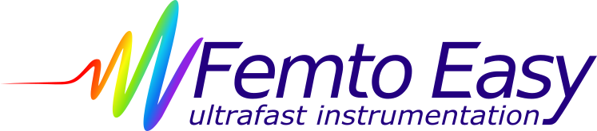
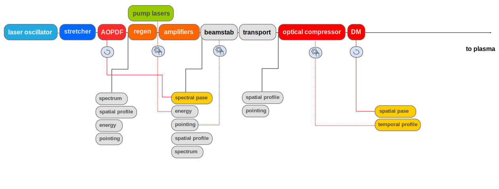
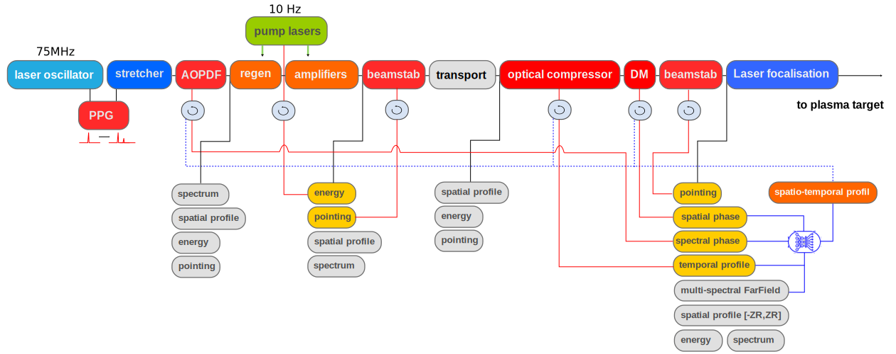
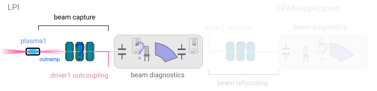

```{r setup, include = FALSE}
library(knitr)
library(tidyverse)
library(nhsrtheme)
library(xaringanExtra)
# set default options
opts_chunk$set(echo = FALSE,
               fig.width = 7.252,
               fig.height = 4,
               dpi = 300)
xaringanExtra::use_panelset()
xaringanExtra::use_broadcast()
xaringanExtra::use_share_again()
xaringanExtra::style_share_again(share_buttons = c("twitter", "linkedin"))
# uncomment the following lines if you want to use the NHS-R theme colours by default
# scale_fill_continuous <- partial(scale_fill_nhs, discrete = FALSE)
# scale_fill_discrete <- partial(scale_fill_nhs, discrete = TRUE)
# scale_colour_continuous <- partial(scale_colour_nhs, discrete = FALSE)
# scale_colour_discrete <- partial(scale_colour_nhs, discrete = TRUE)
```

```{r metathis, echo=FALSE}
library(metathis)
meta() %>%
  meta_description("Presentation of PALLAS project at IN2P3 CS")
  meta_name("github-repo" = "https://kevincassou.github.io/slides/CS-IN2P3/slides/") %>% 
  meta_social(
    title = "PALLAS PROJECT",
    description = paste(
      "laser-plasma accelerator test falicility @ IN2P3"
    ),
    url = "https://kevincassou.github.io/slides/CS-IN2P3/slides/PALLAS-CSI-2021.html",
    image = "https://box.in2p3.fr/index.php/s/pNLLcbYo6EtY8DP/preview",
    image_alt = paste(
      "CNRS/IN2P3/Université Paris-Saclay; IJClab:", 
      "Scale high-quality research data provisioning with R packages,", 
      "presented at Conseil Scientifique IN2P3 2021/02/09 by K. Cassou"
    ),
    og_type = "website",
    og_author = "CNRS/IN2P3/IJClab",
    twitter_card_type = "summary_large_image",
    twitter_creator = "@Cassoukevin",
    twitter_site = "@IJClab"
  )
```

layout: true 

<div class="my-header"></div>

<div class="my-footer">
<span>
 &emsp;
 &emsp; 

| &emsp; CS-IN2P3 &emsp; | &emsp; accelerator &emsp; | &emsp; 2021/02/09 &emsp;  |
&emsp;&emsp;&emsp;&emsp;&emsp;&emsp;&emsp;&emsp;&emsp;&emsp;&emsp;&emsp;&emsp;
&emsp;&emsp;&emsp;&emsp;&emsp;&emsp;&emsp;&emsp;&emsp;&emsp;&emsp;&emsp;
 </span></div>


---
class: title-slide, left, bottom

# `r rmarkdown::metadata$title`
----
## .blue[**`r rmarkdown::metadata$subtitle`**]
### `r rmarkdown::metadata$author`
### `r rmarkdown::metadata$date`

---
class: center, middle

## on behalf ot the team 


.footnote[
Ce document est la propriété d’IJCLab et ne peut être ni reproduit ni diffusé sans autorisation du laboratoire.
This document is written by the IJCLab. It is an IJCLab property and cannot be reproduced or communicated without this authorization.

]

---

# A view of present LPA status for FEL


Required beam parameters are : **energy spread <1%; beam brightness 5 pC/MeV; stability ~ 1 % **

--
.pull-left[

**.green[COXINEL (SOLEIL-LOA)]**:

- LPI : injection by ionization / gas jet 
- Electron beam brightness issue ~ 0.2-0.3 < 5 pC/MeV [design value] @ 2.5Hz
- LPA beam transport studies <sup>1</sup>
- observation of spontaneous emission


```{r echo=FALSE, out.width="50%"}
knitr::include_graphics("img/coxinel.png")

```
]

--

.pull-right[
**.qblue[LUX (DESY-UHH)]**:

- LPI : injection by ionization / gas cell 
- Effort on reliability and control since 2016
- Electron beam stable energy spread 15%<sup>3</sup> .red[-> ~1%], peak brightness  ~0.5 .red[-> 5] pC/MeV @ 1Hz 

```{r echo=FALSE, out.width="110%"}
knitr::include_graphics("img/lux.png")
```

]

.center[.orange[a transition has started toward potential reliable sources and laser-plasma accelerators]]

.footnote[

[1] [M. Labat et al., Phys. Rev. Accel. Beams, vol. 21, no. 11, p. 114802, Nov. 2018](https://link.aps.org/doi/10.1103/PhysRevAccelBeams.21.114802);  [T. André et al., Nat Commun, vol. 9, no. 1, p. 1334, Dec. 2018](http://www.nature.com/articles/s41467-018-03776-x) 

[3] A. R. Maier et al., Phys. Rev. X, vol. 10, no. 3, p. 031039, Aug. 2020, [doi: 10.1103/PhysRevX.10.031039](https://doi.org/10.1103/PhysRevX.10.031039); M. Kirchen *et al.* and S. Jalas *et al.* submitted (2021) 


] 


---
class: inverse, middle center 

# National and (international) context


---
name: national

# National overview 

.blue[**07/2019**]: discussions 2 projects emerged structuring a potential French contribution to 
.center[
```{r echo=FALSE, out.width="80%"}

```
]

--

.blue[**01/2020**]: IJClab commit to support in the infrastructure renewing for PALLAS (CPER) 

--

.blue[**04/2020**]: national master project **PALLAS**, CNRS worked for a EuPRAXIA CA, IJClab representing CNRS.

--

.blue[**06/2020**]: **PIA3-PACIFICS** national R&D project for future accelerator submitted, **one axe devoted to LPA R&D** 

--

.blue[**07/2020**]: exceptional financial support .lgrey[[COVID19]] => important kick start for the project 

--

.blue[**12/2020**]: **PIA3-PACIFICS** national project accepted, pending to final financial arbitration .orange[75% funding confirmed].  


---
name: lpa-in2p3
# Laser-plasma R&D @ IN2P3 ? 

.panelset[
.panel[.panel-name[LASERIX facility]

.pink[**LASERIX**] **40 TW, 10 Hz** laser driver of the .pink[Université Paris Saclay] with unique features in the short term project funded research :

- **Constant maintenance and upgrade** by Université Paris Sud over a more than a decade (~130k€/year + >800k€ investment CPER POLA) 
- Aggregation of unique competencies in a cohesive team
- Localization close to a **radiation shielded area NEPAL** (PHIL) 
- Part of the material to upgrade the laser system to 300 TW<sup>1</sup>, 0.1Hz existing

.center[
```{r echo=FALSE, out.width="25%",fig.pos="!b"}
knitr::include_graphics("img/laserix-system.png")
```
]
.tiny[
[1] Ref. F. Ple et al., "Design and demonstration of a high-energy booster amplifier for a high-repetition rate petawatt class laser system," Opt. Lett. 32, 238-240 (2007)
]

]
.panel[.panel-name[SMILEI numerical platform]

  numerical experimental platform  [](https://smileipic.github.io/Smilei/) &emsp;&emsp;&emsp;  

- High performance / high fidelity  open source PIC-code, recent development bringing unique feature in a super competitive domain of HPC simulation 
.center[
```{r echo=FALSE, out.width="30%"}
knitr::include_graphics("img/smilei.png")
```
]
- Collaboration project : .blue[**VIRTUAL LAPLACE**] gathering the community (LLR,LOA, IJClab) to access to GENCI HPC resources : successful grant on the **A9** genci call. 
<br>
.tiny[
[ref.] [J. Derouillat *et al.*, ‘Smilei : A collaborative, open-source, multi-purpose particle-in-cell code for plasma simulation’, Computer Physics Communications, vol. 222, pp. 351–373. 2018](https://doi.org/10.1016/j.cpc.2017.09.024) ; [F. Massimo, *et al.*, Phys. Rev. E, vol. 102, no. 3, p. 033204, 2020](https://doi.org/10.1103/PhysRevE.102.033204)

]


]
.panel[.panel-name[Environment]

**+** [ : scientific discussion networking tool for the French LPA community](http://gdr-appel.fr/)

- monthly news
- thematic meeting (target, LPA application to medical sciences, etc.) 

.orange[**+**]  access to national multi-PW laser  infrastructure an [LFA](https://apollonlaserfacility.cnrs.fr/salle-longue-focale/) experiment zone

.orange[**+**] high regional concentration of world leader laser & photonic industrial companies

.center[&emsp; &emsp; &emsp; &emsp; &emsp; &emsp; &emsp; &emsp;  <br>
&emsp; &emsp; ]
]
]


---
class: inverse, middle center 

# PALLAS project 


---
name: pallas-objectives

# Objectives

Build a laser-plasma **accelerator test facility** aiming to achieve **reliability** and **control** comparable to conventional **RF accelerator** standards.

Push LPA technological development starting with a **laser-plasma injector** (**LPI**) prototype

```{r echo=FALSE, out.width="80%"}
knitr::include_graphics("img/lpi.png")
```

Research and development lines :

1. advanced .red[**laser control**]
2. development of .blue[**plasma targetry**] => plasma cell
3. electron .dgrey[**beam control and transport**]

Achieved fully optimized and controlled LPI  

.center[.orange[**First brick of a more ambitious beamline with second plasma stage (LPAS) or applications**]]


---
name: pallas-parameters

# Electron beam parameters

.pull-left[
- Staged effort:  

  **phase 1** : laser optimization & control, target <br>
  first electron characterization
  
  **phase 2** : laser and beamline upgrade <br>
  electron beam optimization 
  
  **phase 3** : transport beamline <br>
  full LPI optimization 
  


- .blue[EuPRAXIA] parameters for technical design study <sup>1</sup>

- **continuous 10 Hz** beam to enable machine studies
]


.pull-right[
<br>

.small[
| Parameters | phase 1 | phase 2 | phase 3 | unit | 
| --:| :--:|:--:|:--:| --:|
| energy  | 150  | **200** | 200 | MeV |
| charge  | 15-30 | **30** | 30 | pC |
| frep | 10 | 10 | 10 | Hz |
| energy spread | <10% | **< 5% ** | < 5% | peak (FWHM) |
| $\varepsilon_{T,n}$  | 1 | **<1** | <1 | mm.mrad |
| stability | 5% | **3%** | **1%** | -  |
| reproductibility | 5% | **3%** | 3% | - | 
]

.small[ Nota bene : **value phase 3** are considered at the virtual entrance of a second laser-plasma accelerating stage.
]

]


.footnote[

[1] R. Assmann, ‘EuPRAXIA Conceptual Design Report’, Hamburg, 2019. [Online]. Available: https://desycloud.desy.de/index.php/s/X37pwaJxEGi2God.
]

---
name: pallas-parameters

# LPI parameters


Configuration of the LPI : laser driver, plasma,   
<br>
.center[
.small[
| Parameters | phase 1 | phase 2 | phase 3 | unit | 
| --:| :--:|:--:|:--:| --:|
| laser strengh, $a_0$  | 1.15  | **1.97**  | **1.97** | |
| laser duration, $t_L$  | 40 | **30** | **30** | fs (FWHM) |
| laser waist, $w_0$ | 18 | 18 | 18 | um |
| Strehl ratio, $S_r$ | **> 0.8** | **> 0.8** | **> 0.8** |- |
| beam pointing, $\delta u_i$ | **<0.5** | **<0.5** | **<0.5** | urad
| stability  | 1% | **<1%** | **<1%** | -  |
| frep | 10 | 10 | 10 | Hz |
| target type | multi-cell | multi-cell |  multi-cell | -|
| **injection** | STII | STII  | STII |  - |
| electron beamline | *TBD* | *TBD* | *TBD* | - |
]
]


.footnote[
STII : Self truncated injection / downramp assisted ionization injection to be optimized <br>
TBD : to be defined. 

]


---
name: approach

# Our approach 

**Guidelines**  

- .blue[**Modularity**] : accelerator divided in module 
- .blue[**Reliability**] :  high performances laser optics 
.orange[+] over sized optical compressor (350TW-class grating used @ 40TW) 
.orange[+] optimized laser-driver diagnostic implementation 
- .blue[**Compactness**] : [plasma target](#plasmatargetry2) integrated in the accelerator beamline 
- .blue[**Scalable**] : to high repetition rate (starting in the middle range 10Hz)

--

**Online control (laser / electron)**

-  control command,  webpage based UI
- Full  10 GB/s network acquisition, 10Hz time-stamping, automated data-storage 
- Design oriented for and to ease application of .pink[**Machine Learning**] technics

--

**Stepwise approach (cost / complexity)**

- .qblue[**Staged implementation**] : from the source characterization to more and more complex electron beamline
- .qblue[**Parallel development**] : [plasma cell test bench](#plasmacell) , online laser field control [ML-COLA]()<sup>1</sup> 
- .qblue[**Simulation support**]: reinforce collaboration between experimental and numerical people

.center[ .orange[**Open to the community in the spirit of accelerator development:  OpenHardware / OpenData**]]

.footnote[
ML-COLA: P2IO project (2021-2022), V. Kubytskyi and M. Pittman *Proof of the principle experiment of Machine Learning based online Characterization and Optimisation of a high intensity LAser pulse*.
]


---
class: middle,center,inverse

# Advanced laser control


---
name: lasercontrol1

# Laser performances & control

.orange[**30-100 TW class laser system = complex system**] 

overview of the LASERIX Ti:Sa chirped pulse amplification laser driver system

   

---
name: lasercontrol3

# Laser performances & control

current status without feedback : 
.pull-left[
```{r echo=FALSE, out.width="100%",fig.pos="!b"}
   
```
]

.pull-right[
```{r echo=FALSE, out.width="100%",fig.pos="!b"}
knitr::include_graphics("img/laserstab.png")
```
]

**+** laser pulse duration $\tau_l = 40\,\pm 3$ fs stability  <10% (RMS)

.center[.orange[bring **errors** of laser pulse properties (E, t, Sr) **below <1%**]]


---
name: lasercontrol2

# Laser performances & control

   

* **add** active beam .dgrey[**pointing stabilization**]   
* **add** online development of .orange[**laser field spatio-temporal distortion**] monitoring    
* **add** longitutinal pulse shaping = controlled pre-pulse for preformed plasma channel (.red[PPG]) 
* full **data-logging** and **gateway** to accelerator control command   


---
class: middle,center,inverse

# Plasma target 


---
name: plasmatargetry1

# Plasma target

### develop engineering of laser-plasma accelerating structure 

**Characteristics length** of a plasma target for LPI ( $10^{18} \leq n_e \leq 10^{19}\,$ cm $^{-3}$ ) :

- Rayleigh length of the laser  &emsp; $\,\rightarrow\,$ &emsp; $Z_r=\pi w_0^2/\lambda_0 \sim 1.3\,$mm
- Plasma wavelength &emsp; &emsp; &emsp; &emsp; $\rightarrow$ &emsp; $\lambda_p \approx 10-30\,\mu m$ 
- Betatron wavelength  &emsp; &emsp; &emsp; $\,\,\,\,\rightarrow$ &emsp; $\lambda_\beta =\sqrt{2\gamma_e}\lambda_p \sim 250-800\,\mu m$ 

**Tailoring plasma density profile**: 

- **.qblue[to control injection]** : density down-ramp assisted truncated ionization injection <sup>1</sup> <br>
$\Rightarrow$ narrowing of the injection length <sup>2</sup>
- **.blue[tune]** the injected **.qblue[charge / beam loading]** <sup>3</sup>
- **tune** e- **.qblue[beam energy]** / acceleration length
- **limit .qblue[emittance growth]** at the exit of the plasma / minimized Twiss parameters  <br> $\Rightarrow$
Control of the exit down ramp is crucial !  

.center[ .red[**... in only few mm**]  ]

---
name: plasmadensity

# Plasma density profile : an illustration

.left-code[
Example of simulation:  
* LASERIX laser input
* generic shape for .qblue[n<sub>e</sub>(x)] inspired from various ref<sup>1</sup>
* parameter : .black[x<sub>foc,vac</sub>]


mMulti-cell to get access to each region tuning : 

  * length and density  
  * dopant C<sub>N<sub>2</sub></sub>(x) 
  
  
.black[Open ways to:
* Fine optimization 
* Control
* Tolerancing
]

]
.right-plot[

```{r echo=FALSE, out.width="98%",fig.pos="!b"}
knitr::include_graphics("img/fig-cs2.svg")
```
]

.footnote[
[1] [G. Golovin et al., Phys. Rev. ST Accel. Beams,**18**,1,011301,(2015)](https://doi.org/ 10.1103/PhysRevSTAB.18.011301); [M. Mirzaie et al., Sci Rep,**5**,1,14659,(2015)](https://doi.org/10.1038/srep14659).
; [A. Irman et al., Plasma Phys. Control. Fusion, **60**, 4,044015,(2018)](https://doi.org/10.1088/1361-6587/aaaef1), [P. Lee, et al., Phys. Rev. Accel. Beams, **21**,5, 052802, (2018)](https://doi.org/10.1103/PhysRevAccelBeams.21.052802).


]

---
name: LPIsimulation

# Optimization of the LPI core 

.pull-left[
.blue[**Input**] 
* **laser parameters** in vacuum (a<sub>0</sub>,t<sub>0</sub>,w<sub>0</sub>,x<sub>0</sub>) <sup>1</sup>
* .qblue[**plasma target**]:  continuous laminar flow gas cell <br>
$\Rightarrow$ $n_e(x)$  $\propto$ cell geometry + $Q_i$ gas flow

.blue[**Tools:**] 

* **Fast PIC** simulations
  - Azimuthal modes geometry
  - envelope approximation for the laser.  
* **Laminar conductance rough model** for cell geometry as CAD input
* **CFD** [Openfoam](https://www.openfoam.com/) / [snappyHexmesh](https://www.openfoam.com/documentation/guides/latest/doc/guide-meshing-snappyhexmesh.html)  couple to CAD 
* Tracking particle code coupling [ASTRA](https://www.desy.de/~mpyflo/)/CODAL
]
.pull-right[

```{r echo=FALSE, out.width="180%",fig.pos="!b"}

```

]

<br>
.center[.orange[all the ingredient for a **full numerical optimization** of the plasma cell ...]]

.footnote[
[1] in phase 1 : limited to $a_0=1.15\pm0.8$ and $\tau_L = 40\pm3$ fs (FWHM) 

]


---
name: plasmatargetry3

# Plasma target

### prototype preliminary design 

* divide in region / process
* customizable part (nozzle in, central body , nozzle out)
* integrate in the beamline (*10x6x15* cm<sup>3</sup>)
* transverse optical access 


.pull-left[
```{r echo=FALSE, out.width="100%"}
knitr::include_graphics("img/plasmatarget1.svg")
```
]

.pull-right[

```{r echo=FALSE, out.width="100%"}
knitr::include_graphics("img/plasmatarget2.svg")
```
]


---
name: plasmacell

#Plasma cell test bench

.pull-left[
Dedicated test bench for plasma cell: 
-  **fs intense laser driver **   $I \sim 5\times 10^{16}\, W.cm^{-2}$ for plasma channel generation
- **synchronized probe beam** for time resolved transverse interferometry 
- high resolution **plasma density diagnostic** <sup>1</sup> $\delta n_e \sim 5\times 10^{17} cm^{-3}$
- spectral imaging for **dopant spatial distribution control** <sup>2</sup>
- multiple **mass-flow controlled gas injection**
- continuous flow target operation with **two stages differential pumping**

]

.pull-right[

```{r echo=FALSE, out.width="100%"}
knitr::include_graphics("img/plasmacell-testbench.png")
```

]

View of the plasma test bench under commissioning with long testing cell<sup>3</sup>

.footnote[
[1] [F. Brandi and L. A. Gizzi, High Pow Laser Sci Eng, vol. 7, p. e26, 2019](https://www.cambridge.org/core/product/identifier/S2095471919000112/type/journal_article); Phasics, ‘SID4 High resolution wavefront sensor, http://phasicscorp.com/cameras/sid4/ (2020).

[2] [B. B. Pollock et al., Phys. Rev. Lett., vol. 107, no. 4, p. 045001, Jul. 2011](https://doi.org/10.1103/PhysRevLett.107.045001).

[3] K. Wang, PhD, 2019 in ESCULAP project.

]


---
class: middle,center,inverse


# Electron beam control and transport


---
name:eCBL1

# Electron beam line 
### main challenges


.left-column[
```{r echo=FALSE, out.width="100%"}

```
]

.right-column[
**main difficulties already highlighted in the literature:**

* laser removal from *e-* path
* *e-* divergence
* large $\Delta E/E$
* low charge and 10-20% fluctuations 
* orbit stability
* sensitivity to error
* bunch lengthening

**our strategy = stepwise approach **

* well known beam properties
* minimize divergence at the source
* energy selection in the peak
* transverse / longitudinal manipulation
* maximize flexibility
]


---
name:eCBL2

# Electron beam line : characterization to control 


.center[
```{r echo=FALSE, out.width="70%"}

```
]

.pull-left[
### *e-* beam characterization
**Design**: start from PIC simulation parameters <br> **+** explore different capture/focusing scenarii <br>
**Beamline**: magnets with remote alignment <br>
**+** correctors and BPM <br>
**Diags**:  robust diagnostics: Yag screen, faraday cups<br>
**+** wide angular acceptance spectrometer <br> **+**
emittance measurement 

]

.pull-right[
### beam/laser/plasma correlations

* **single shot** characterized **diags** / SNR 
* **online control** laser/plasma/magnets
* machine learning correction 
]

.center[.orange[**+** **additional diagnostic** prevously tested on our photo-injector PHIL for beam duration and **longitudinal phase-space** measurement]]


---
name:eCBL3

# Electron beam line: transport

.center[
```{r echo=FALSE, out.width="70%"}

```
]

.pull-left[
### transport line for staging

**incoupling/outcoupling driver**: 
chicane,dogleg;  plasma mirror

**focus close to plasma exit** : Quapeva; plasma lens

**energy spread**: demixing chicane; D-chicane

**Orbit**: Response matrix; lattice optimization in the dogleg
]

.pull-right[
```{r echo=FALSE, out.width="120%"}

```

]


---
# Development plan 


.panelset[
.panel[.panel-name[phase 1]

### 2020-2022:  base of the LPI facility 

* **infrastructure upgrade** : renovation, network, PHIL reconfiguration 

* **laser driver commissioning** :  .blue[laser transport, compression, injection and focalisation]

* **control command development** : .blue[ tango laser gateway +  tango system / DS and GUI for laser transport and injection control + time stamping and automated storage ] 

 .center[.red[** => laser driver optimized **]]
 
* **optimization of plasma injector design / target development **:  PIC simulations optimization studies for injection control and emittance;  target prototyping and testing; plasma module 

 .center[.red[** => target prototype**]]

* **e- characterization beam line**: .blue[ simple characterization beamline : charge,energy,divergence,emittance dE/E ]


 .center[.red[** => first e- beam parameters optimization run at 10Hz.** ]]

]

.panel[.panel-name[phase 2]

### 2023-2024: laser driver and electron beamline upgrade 

* **laser driver upgrade** on target: $\tau_l= 40 \rightarrow 30$ fs, $E_{L,t} = 1.3 \rightarrow 2.5$ J 
  - same amplifier larger Ti:Sa crystal,  one more pump laser<br>
  - ultra broadband Dazzler for high order spectral phase correction 

* **upgrade of electron beamline** : on the base of phase 1 measurements : BPM, focusing section and correctors. 
  
* **beam quality & control optimization studies** $\Rightarrow$ correlation [laser,plasma,electron] $\Rightarrow$ feedback development 

* longitudinal phase space diagnostic development 

* .qblue[electron transport technical design studies] 

.center[.orange[**phase 2 e- beam parameter optimized at 10Hz.**]]

]

.panel[.panel-name[phase 3]

### 2024-2026: e- beam transport 


* installation of the complete electron beam transport line (for staging or application delivery, focused beam)

* installation of the end diagnostic station 

* commissioning and optimization of the **full LPI**

* .qblue[design study for a second laser-plasma accelerating stage]

.center[.orange[**phase 3 LPI operating at 10Hz, beam longitudinal phase space manipulation**]]

]
]


---
name: costs

# Budget & costs

.right[   &emsp;]
 

* **84 %** of the equipment budget is consolidated. 
* budget relies on:
  - substantial support (564k€) from CNRS-IN2P3 to the master project PALLAS
  - projection of last year Université Paris Saclay support despite the growing activities 


.center[
```{r echo=FALSE, out.width="75%"}

```
]


---
name: schedule

# Schedule

.center[
```{r echo=FALSE, out.width="100%"}

```
]

---
name: resources
# Resources

* Project team is about **~30 persons** [IJClab,LLR, LCP, CEA] / average of **7.5 FTE **
* Project team **snapshot for 2021**

```{r echo=FALSE, out.width="100%"}
knitr::include_graphics("img/resources-2021.png")
```

* Strong engineering capacities on accelerator, laser, optics, plasma and experimentation 
* Delicate situation possible with ThomX delay
* Midterm FTE weakness **PIC code development** for LPA (Smilei 1FTE) and theoretical on laser-plasma interaction must be reinforced

.center[.orange[ **Magnetism** and **beam dynamic** must be reinforced at the lab level]]

---
name: swot

# SWOT analysis 

.pull-left[

.blue[**Strengths**] 

* Unique 10Hz laser-plasma accelerator test facility with >22 weeks/year beam time   
* State of the art laser driver supported (operation) by Université Paris-Saclay 
* Strong engineering support  

.orange[**Opportunities**]
* link with SMILEI team 
* EuPRAXIA 
* Plasma cell development for other LPA experiments
* Industrial collaboration

]

.pull-right[

**Weaknesses**

* No magnet services in the lab. 
* Limited funding. 
* Starting late in competitive and dynamic domain
* organization/administration.
<br>
<br>
<br>

.orange[**Threats**]

* ASN 
* Some spares can not be covered by the budget.

]


---
name: infras1

# Infrastructures : overview 


```{r echo=FALSE, out.width="100%"}
knitr::include_graphics("img/NEPAL_CAD_topview.png")
```

---
name: infras2

# Infrastructures : overview 

.pull-left[
```{r echo=FALSE, out.width="100%"}

```
]

.pull-right[
```{r echo=FALSE, out.width="100%"}
knitr::include_graphics("img/nepal_after.png")
```
]

---
name: summary

# Summary


* Unique opportunities to build a **10Hz laser-plasma accelerator test facility**

* **Push back the laser-plasma technology frontiers** to high reliability and control  

* **Complementary** to national effort at CNRS-INP (LAPLACE, ApoLLon) in the **EuPRAXIA context**  
* Strategy align with [*2020 Update of European Strategy for Particle Physic*, preamble p. 8](https://cds.cern.ch/record/2721370/files/CERN-ESU-015-2020%20Update%20European%20Strategy.pdf) : 
.small[
  >Innovative accelerator technology underpins the physics reach of high-energy and high-intensity colliders. It is also a powerful driver for many accelerator-based fields of science and industry. **The technologies under consideration include** high-field magnets, high-temperature superconductors, **plasma wakefield acceleration** and other high-gradient accelerating structures, bright muon beams, energy recovery linacs. The European particle physics community **must intensify accelerator R&D and sustain it with adequate resources**. A roadmap should **prioritise the technology**, taking into account synergies with international partners and other communities such as photon and neutron sources, fusion energy and industry. Deliverables for this decade should be defined in a timely fashion and coordinated among CERN and national laboratories and institutes.
]


 **@IN2P3**  :  Reinforce competences and position in future innovative accelerator technologies

 **Requirement for IN2P3** : a strong financial support of 564 k€ over 2022-2025 is required to the IN2P3 + 2 post-doc and doc positions.


---
class: middle center


# Thanks !  

<br>
<br>

.blue[ :] [kevin cassou](mailto:cassou@lal.in2p3.fr)

.footnote[
Ce document est la propriété d’IJCLab et ne peut être ni reproduit ni diffusé sans autorisation du laboratoire.
This document is written by the IJCLab. It is an IJCLab property and cannot be reproduced or communicated without this authorization.

]

---
class: inverse, middle, center

# Back slides


---
class: middle,center
background-image: url(img/laserix.png)
background-size: cover

# .


---
class: inverse, center, middle

# Laser wakefield acceleration

---
name:bubble

# in a bubble 

some basics
.pull-left[

```{r echo = FALSE, fig.pos="h", out.width="90%"}
knitr::include_graphics("img/wakefield.png")
```

]

.pull-right[
laser driver in underdense plasma ( $n_0\sim 10^{18}$ cm $^{-3}$)  :

$$F_p = -m_e c^2 \nabla (a^2/2)$$
$$a = eE_L/ m_e\omega_L c$$
non linear regime $a>1$, in 1D, plasma wakefield, density pertubation:  

$$\frac{\delta n}{ n_0} =\frac{1}{2} \left[ \frac{1+a^2}{(1+\phi)^2}-1\right]$$
]

.pull-left[

.green[**+**] **High accelerating field**, $E_0 \sim 100\,$ GV/m<sup>1</sup>

.green[**+**] **ultra short bunches**, $\sim10$ fs  <sup>2</sup>
]

.pull-right[

.red[-] **tiny transient structure**  $\sim10\mu$m

.red[-] **hard to control** $\rightarrow$ large fluctuation

]

.footnote[
[1] E. Esarey, *et al.* (2009), [doi: 10.1103/RevModPhys.81.1229](https://doi.org/10.1103/RevModPhys.81.1229)

[2] O. Lundh, *et al.* (2011),[doi: 10.1038/s41598-020-73805-7](http://www.nature.com/articles/s41598-020-73805-7), src img Hansson et al. Phd (2016)
]


---
name: injection
# Injection ... 

so many way to surf the plasma wake waves... when increasing the laser driver intensity (.orange[a<sub>0</sub>]): 

.panelset[
.panel[.panel-name[external]
.pull-left[
.left[
.orange[a<sub>0</sub> ~1 ]

**+** linear regime control acceleration

**-** requires a RF linac

**-** coupling to the plasma wake 
focusing / timing

* very low charge $\sim20$ fC <sup>1 </sup>
* timing constraints $\sim\lambda_p/c$ 
</br>
</br>
</br>
</br>
.tiny[
[1] [ B. Marchetti et al.,NIMA  vol. 829, pp. 278–283, Sep. 2016](https://doi.org/10.1016/j.nima.2016.03.041) </br>
[2] [Y. Wu et al. arXiv (2020)](https://arxiv.org/ftp/arxiv/papers/2005/2005.00183.pdf)
]
]

]


.pull-right[

```{r echo=FALSE, out.width="100%"}
knitr::include_graphics("img/external_injection.png")
```

]

] <!---->


.panel[.panel-name[ionization]
.pull-left[
.left[
.orange[a<sub>0</sub> >2]

**+** Use k-shell of high-Z gas «electron born»  in the right place <sup>1</sup> 
and weakly nonlinear

**-** easy injection leading to broad spectrum<sup>2</sup>

but evolution of the method using unmatched<sup>3</sup> laser conditions 

**>** Self truncated ionization injection (STII)<sup>4</sup>


.tiny[
[1] [M. Chen et al.  Physics of Plasmas, vol. 19, no. 3, p. 033101, Mar. 2012,](https://doi.org/10.1063/1.3689922)
<br>
[2] [C. E. Clayton et al., Phys. Rev. Lett., vol. 105, no. 10, p. 105003, Sep. 2010](https://doi.org10.1103/PhysRevLett.105.105003).
<br>
[3] [W. Lu et al., Phys. Rev. ST Accel. Beams, vol. 10, no. 6, p. 061301, Jun. 2007](https://doi.org/10.1103/PhysRevSTAB.10.061301).
<br>
[4] [A. Irman et al., Plasma Phys. Control. Fusion, vol. 60, no. 4, p. 044015, Apr.](https://doi/10.1088/1361-6587/aaaef1)

]
]

]

.pull-right[

```{r echo=FALSE, out.width="75%"}
knitr::include_graphics("img/ionization_injection.png")
```

]
] <!---->

.panel[.panel-name[density down-ramp]
.pull-left[
.left[
.orange[a<sub>0</sub> >3]

**+** slow down the wake <sup>1</sup>

**+** localized injection 

**+** high charge <sup>2</sup>, high quality beam <sup>3</sup>

**-** gradient stability / charge energy coupled

</br>
</br>

.tiny[
[1] [H. Ekerfelt, et al., Sci Rep, vol. 7, no. 1, p. 12229, Dec. 2017](https:/doi.org/10.1038/s41598-017-12560-8)<br>
[2] [J. Götzfried et al., Phys. Rev. X, vol. 10, no. 4, p. 041015, Oct. 2020](https://link.aps.org/doi/10.1103/PhysRevX.10.041015)<br>
[3] [H.-E. Tsai et al., Physics of Plasmas, vol. 25, no. 4, p. 043107, Apr. 2018](https://doi.org/10.1063/1.5023694)


]

]]
.pull-right[

```{r echo=FALSE, out.width="110%"}

```

]
]

.panel[.panel-name[self-injection]
.pull-left[
.left[
.orange[a<sub>0</sub> >4]

**+** easy to implement drive wake into breaking

**-** very high laser laser intensity

**-** difficult to control
<br>
<br>
<br>
<br>
<br>
.tiny[
[1] Pukhov, A. & Meyer-ter Vehn, J.  Appl. Phys. B 74, 355–361 (2002)
<br>
[2] Faure *et al.*, Geddes *et al.*, Mangles *et al.* in Nature 431 (2004)
]

]]

.pull-right[
```{r echo=FALSE, out.width="100%"}

```
]
]

]<!---->

---
name: lpaexp
# typical laser-plasma experimental setup

For production of $100<E<500$ MeV, in a large vacuum chamber: 

.pull-left[
**laser:**

- energy : 0.5-2 J,
- duration: 30-40 fs
- waist : 10-20 um
- repetition rate:1-10 Hz


**Plasma:**

- target: supersonic gas jet 1-4 mm/gas cell 1-50mm, capillary discharge (>50mm)
- gas: $H_2$ or $He$ ( $+0.1-10\% N_2$ )
- density: $1-50\times10^{18}$ $cm^{-3}$ 

]

.pull-right[

```{r echo = FALSE, fig.pos="h", out.width="100%"}
knitr::include_graphics("img/lpa-exp.png")
```
.tiny[src: *Mangles, S. P. D. et al. Nature 431, 535–8 (2004)* ]
]
<br>
<br>
<br>


---

# LPA state of the art 

LPA a .orange[**one**] parameter optimization performer 

.center[
```{r echo=FALSE, out.width="90%"}
knitr::include_graphics("img/stateoftheart-lpa.png")
```
]

.small[*Note : contact for detail references*]
  
  
---
name: laserediag

# laser control & diags details

control of the laser driver is the key 

  * 38 CCDs + (12)
  * 6 points energy measurement (+2)
  * 3 spectrometers (+1)
  * .orange[**spectral control loop**]: ultra broadband dazzler + additional wizzler => correct higher phase order 
  * .blue[**spatial control loop**]:  large aperture deformable mirror + wavefront sensor => Get high Strehl ratio ( $S_r>0.8$ ) and work on intermediate field homogeneity.
  * .red[**pointing stabilization system**] : .dgrey[target value 0.2urad (RMS)!!] <br>
  Spectral side band injection from osscillator for high bandwidth (> 400 Hz ) pointing correction <br>
  Scanning lightweight SiC mirror for large beam stabilization. 
.center[  
```{r echo=FALSE, out.width="15%"}
knitr::include_graphics("img/mirror-SiC.jpg")
```
]
  * high accuracy pulse duration measurement in the interaction region : test most reliable technique for fast reconstruction <sup>1</sup> including pulse front-tilt.


.footnote[
[1] [N. C. Geib, *et al.* , ‘Common pulse retrieval algorithm: a fast and universal method to retrieve ultrashort pulses’, Optica, vol. 6, no. 4, p. 495, Apr. 2019](https://doi.org/10.1364/OPTICA.6.000495.)

]


---
name:lpi-injection 
# LPI parameters versus injection 


.center[
```{r echo=FALSE, out.width="50%"}
knitr::include_graphics("img/lpi-soa.png")
```
]


---
name: organization
background-image: url("img/pallas-wbs-v4.png")
background-size: cover


  
