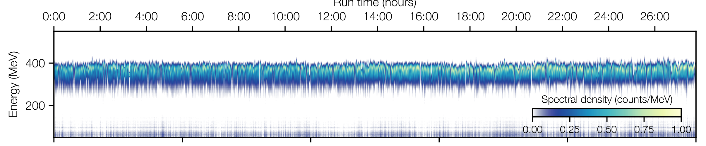
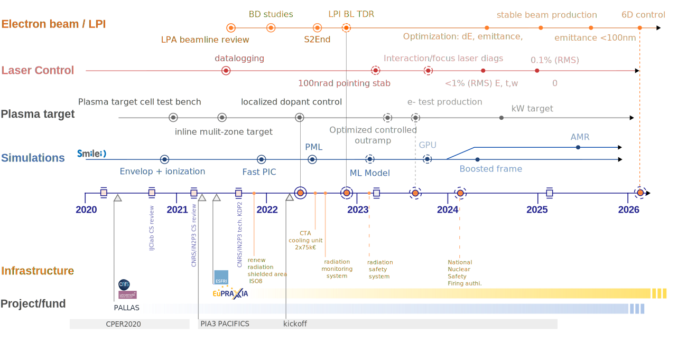
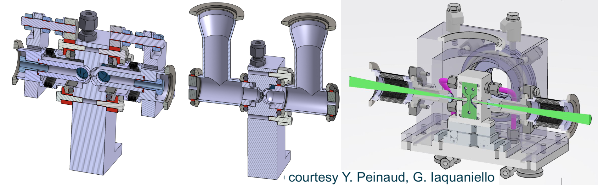
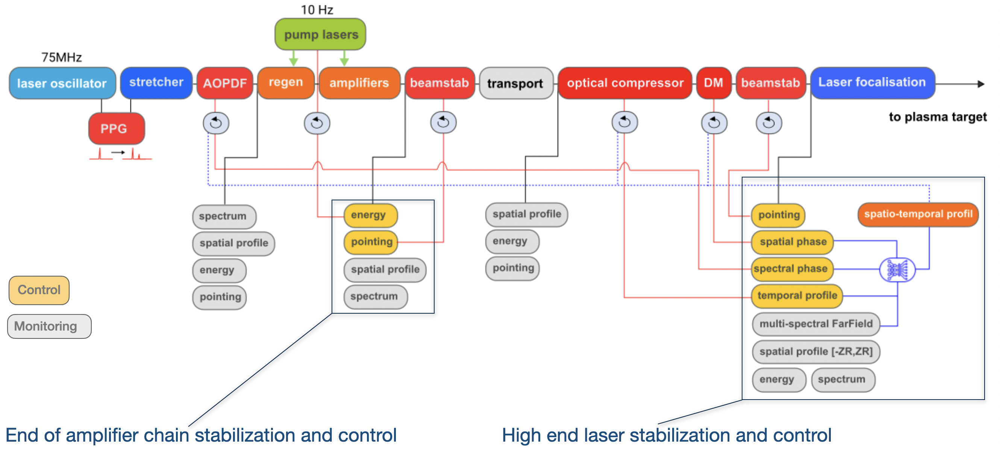
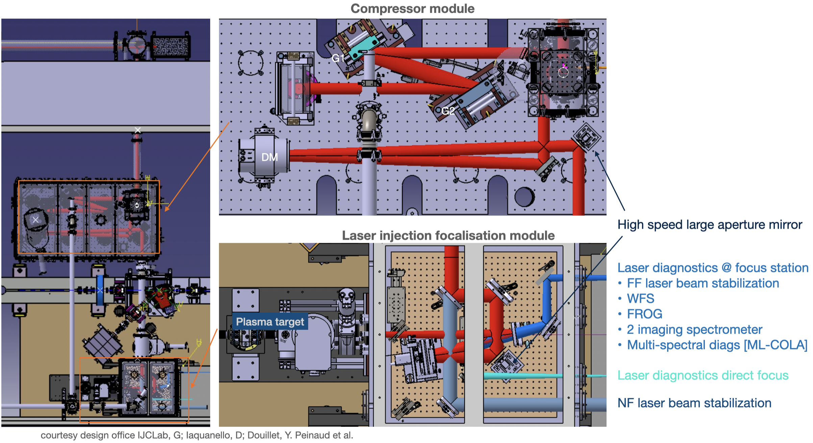
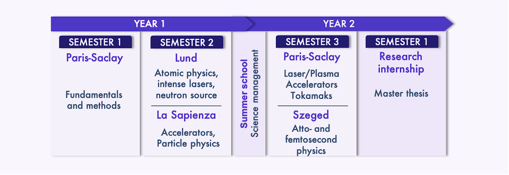

```{r setup, include = FALSE}
library(knitr)
library(tidyverse)
library(NHSRtheme)
library(xaringanExtra)
# set default options
opts_chunk$set(echo = FALSE,
               fig.width = 7.252,
               fig.height = 4,
               dpi = 300)
xaringanExtra::use_panelset()
xaringanExtra::use_clipboard()
xaringanExtra::use_broadcast()
xaringanExtra::use_share_again()
xaringanExtra::style_share_again(share_buttons = c("twitter", "linkedin"))
# uncomment the following lines if you want to use the NHS-R theme colours by default
# scale_fill_continuous <- partial(scale_fill_nhs, discrete = FALSE)
# scale_fill_discrete <- partial(scale_fill_nhs, discrete = TRUE)
# scale_colour_continuous <- partial(scale_colour_nhs, discrete = FALSE)
# scale_colour_discrete <- partial(scale_colour_nhs, discrete = TRUE)
```

```{r metathis, echo=FALSE}
library(metathis)
meta() %>%
  meta_description("Presentation of PALLAS activities vs ESPP")
  meta_name("github-repo" = "https://kevincassou.github.io/slides/CS-IN2P3/slides/") %>% 
  meta_social(
    title = "PALLAS PROJECT",
    description = paste(
      "laser-plasma accelerator test facility @ IN2P3"
    ),
    url = "https://kevincassou.github.io/slides/CS-IN2P3/slides/PALLAS-CSI-2021.html",
    image = "https://box.in2p3.fr/index.php/s/pNLLcbYo6EtY8DP/preview",
    image_alt = paste(
      "CNRS/IN2P3/Université Paris-Saclay; IJClab:", 
      "Scale high-quality research data provisioning with R packages,", 
      "presented at CSS 2022/10/2019 by K. Cassou"
    ),
    og_type = "website",
    og_author = "CNRS/IN2P3/IJClab",
    twitter_card_type = "summary_large_image",
    twitter_creator = "@Cassoukevin",
    twitter_site = "@IJClab"
  )
```


layout: true 

<div class="my-header"></div>

<div class="my-footer">
<span>
 &emsp;
 &emsp; 

| &emsp; CNRS/IJClab &emsp; | &emsp; CSS 2022 &emsp; | &emsp; 2022/10/19 &emsp;  |&emsp; K. Cassou
&emsp;&emsp;&emsp;&emsp;&emsp;&emsp;&emsp;&emsp;&emsp;&emsp;&emsp;&emsp;
&emsp;&emsp;&emsp;&emsp;&emsp;&emsp;&emsp;&emsp;&emsp;&emsp;&emsp;&emsp;
 </span></div>


---
class: title-slide, left, bottom

# `r rmarkdown::metadata$title`
----
## .blue[**`r rmarkdown::metadata$subtitle`**]
### `r rmarkdown::metadata$author`
### `r rmarkdown::metadata$date`

---
class: center, middle

# DRAFT VERSION 

missing references - graph updates

.footnote[
Ce document est la propriété d’IJCLab et ne peut être ni reproduit ni diffusé sans autorisation du laboratoire.
This document is written by the IJCLab. It is an IJCLab property and cannot be reproduced or communicated without this authorization.

]

---
class: center, middle

## on behalf ot the team 

E. Baynard, A. Beck, C. Bruni, K. Cassou, J.L. Coacolo, J. Demailly, D. Douillet, P. Drobniak, P. Gauron, A. Gonnin, C. Guyot, E. Jules, G. Iaquanello, G. Kane, S. Kazamias, V. Kubytsky, E. Legay, B. Lucas, Y. Peinaud, F. Massimo, O. Neveu, M. Pittman, A. Specka


### inspired by fruitful discussion in the HGPL panel <br> and snowmass 21 AF-6 reports
.footnote[
Ce document est la propriété d’IJCLab et ne peut être ni reproduit ni diffusé sans autorisation du laboratoire.
This document is written by the IJCLab. It is an IJCLab property and cannot be reproduced or communicated without this authorization.

]

---
name:PWA

# Plasma wakefield acceleration 

.pull-left[
Advanced accelerator concept exhibing exciting numbers:
* Gradient: 1-100 GV/m <br>
`r fontawesome::fa("arrow-right")` compactness
* ultra short bunches < 100 fs <br>
`r fontawesome::fa("arrow-right")` increased luminosity [1]

Active community,  rapid pace evolution 
]
.pull-right[ Number of publications / year
```{r echo=FALSE, out.width="60%"}

``` 
.small[Google scholar search:
`laser + plasma + wakefield accel* `]
]

*  **beam-driven**: most advanced, high-repetition rate, high efficiency [2,3]

* .qblue[**laser-driven**]: compact, driver-limited repetition rate but ongoing project
(KALDERA, LAPLACE-HR) laser revolution is required for plug wall efficiency
(0.1% $\rightarrow$ >50% )
 .small[*see:* [1] S. Gessner Snowmmass SC,(2021); [2] R. D'Arcy et al. Nature (2022); [3][C. A. Lindstrøm et al., PRL,126,1,014801,(2021)](https://link.aps.org/doi/10.1103/PhysRevLett.126.014801);[4]
[5][C. B. Schroeder et al. AAC 2016 p. 020001.](http://aip.scitation.org/doi/abs/10.1063/1.4965590); [6] [A. J. Gonsalves et al. PRL.,122, 8, 084801, (2019)](https://link.aps.org/doi/10.1103/PhysRevLett.122.084801), see [slide 9](#LPASOA)
]


---
name:challengeLPA1
# Challenges for LPA in collider perspectives `r fontawesome::fa("rocket")`


```{r echo=FALSE, out.width="94%"}

``` 

*src: J. Osterhoff, ECFA, 2019*

---
name:challengeLPA2
# Challenges for LPA in collider perspectives `r fontawesome::fa("rocket")`


```{r echo=FALSE, out.width="94%"}

``` 

*src: J. Osterhoff, ECFA, 2019*

---
name:LPASOA

# Laser-driven plasma accelerator 
### state of the art of laser wakefield acceleration 

```{r echo=FALSE, out.width="94%"}
knitr::include_graphics("img/lwfa-soa_update.png")
``` 

---
class: inverse, middle center 

# Do we have accelerator**s** running on <br> a daily basis <br> based on laser-plasma technology ? 

`r fontawesome::fa("comment-dots")`


---
# `r fontawesome::fa("forward-step")`... first step  

Example of long operation (>20 h) of laser-plasma accelerator at 1Hz,10Hz (DESY) [1] and  1kHz (LOA) [2]
.pull-left[
```{r echo=FALSE, out.width="94%"}

``` 
]
.pull-right[
```{r echo=FALSE, out.width="94%"}

``` 
]

.pull-left[
* Transition from former laser lab demonstration experiment to accelerator lab
* Present performances mainly limited by the laser drivers & target
* Near-term applications will establish technology and benefit future machine (...colliders)

`r fontawesome::fa("triangle-exclamation",fill="orange" )` Need for dedicated beam test facilities

]

.pull-right[
```{r echo=FALSE, out.width="94%"}
knitr::include_graphics("img/worldlasermap-2.svg")
``` 

]


.small[
[1] [A. R. Maier et al.PRX, 10,3, 031039,(2020)](https://link.aps.org/doi/10.1103/PhysRevX.10.031039); [2] Rovige, [L. et al Physics of Plasmas 28, 033105 (2021).](https://aip.scitation.org/doi/10.1063/5.0040926)

]


---
# plasma accelerator French landscape: laser-driven ! 

a view in a few bullets : 

* Is laser centered (some beam driven activities at LOA with SLAC) 

* Paris-Saclay centered : 
  - .qblue[IJClab (CNRS/IN2P3)], LLR(CNRS/IN2P3) LOA (CNRS/INP), LPGP(CNRS/INP)
  - .qblue[IRFU (CEA)],  Lidyl (CEA),
  
* About 20-25 FTE permanent research/engineer spread in 5 different labs and 4 laser facilities ! 
* Laser-Plasma Accelerator (LPA) R&D is mainly focused on compact electron sources for FEL, and secondary sources applications 

* HEP concerned labs: [IJClab]()(PALLAS), LLR([SMILEI]()/Apollon) and [IRFU]() (Earli/[Awake]())
* [Apollon](https://apollonlaserfacility.cnrs.fr/en/home/) laser national facility swallowed up large part of fund in France in the fields and...  not adapted for accelerator R&D but interesting for high energy electron beam demonstration/exploratory experiment and QED  

---
name: LPAFRproject

# LPA main projects in France

.blue[**07/2019**]: LPA community organized $\rightarrow$ discussions 2 projects emerged structuring a potential French contribution to 

.center[
```{r echo=FALSE, out.width="80%"}
knitr::include_graphics("img/lpa-french-center.png")
```
]

And a few years later 

.blue[**PALLAS**] funded by IJClab, IN2P3 and ANR-PIA3 PACIFIS project. 

.blue[**LAPLACE**] funded by CPER and HERACLEUS3 project between Thales and IPP. 

---
# LPA French CNRS landscape

### Dedicated facilities : 
* [**LAPLACE**]() : Laser Plasma Acceleration Center aiming to develop the following axis
  - High repetiton LPA sources for X generation application: 100 Hz, 100 MeV
  - High energy LPA sources >1 GeV single stage, 1Hz and applications
Radiography and irradiation applications
* .blue[**PALLAS**: Prototype accelerator plasma based technology ; laser plasma injector (LPI) test facility (150-250 MeV, 10-100pC, 10Hz) aiming to bring LPI stability and control comparable to RF accelerator.]

### HPC resources 

* **VIRTUALAPLACE** gathering all CNRS and CEA labs involved in plasma acceleration in France for access to [GENCI]() HPC national resources ~ 10M h.cpu (A. Beck, LLR)

[National facility **APOLLON**]() : Multi-PW laser facility for exploratory experiments on laser-matter interaction in ultra-high intensity regime. Call based user access for 2 target area short focal length / long focal length
electron acceleration experiments in LPA. 

---

# Start at the source    


.pull-left[

**Significant step in technology development **
* Addressing mid term challenge in high quality laser driven 
e- beam source 
* Synergy with compact light source development [EuPRAXIA]()

**Feed integrated design studies**
* refine performance limit in key-element towards collider requirement  (drivers / targetry etc ...) 
* hands-on training of future generation of accelerator engineer/physicit

]


.pull-right[
```{r echo=FALSE, out.width="100%"}

``` 
]

.small[[Mounet, N. European Strategy for Particle Physics Accelerator R&D Roadmap. 270 (2022).](http://arxiv.org/abs/2201.07895); [Assmann, R. W. et al. EuPRAXIA Conceptual Design Report. Eur. Phys. J. Spec. Top. 229, 3675–4284 (2020)](http://link.springer.com/10.1140/epjst/e2020-000127-8).
]


---
name: pallas-objectives

# PALLAS in a nutshell


.pull-left[

Build a .qblue[**laser-plasma accelerator test facility**] aiming to achieve **reliability** and **control** comparable to conventional **RF accelerator** standards.

Push **technological development** starting with a: 
* *"high-quality beam"* **laser-plasma injector** (**LPI**) 
* highly mastered LASERIX laser-driver in close collaboration with Industry<sup>1</sup> 

Path to prototype injector for staging to GeV energy


`r fontawesome::fa("stopwatch",fill = "orange")`  .orange[**continuous 10 Hz**] operation

`r icons::academicons("open-data")`   **openData**: 
- push for reproducibility simulations and exp./ 
- encourage common definition of standards 

]

.pull-right[
```{r echo=FALSE, out.width="100%"}
knitr::include_graphics("img/lpi.png")
``` 
.small[
| Parameters | phase 1 | phase 2 | phase 3 | unit | 
| --:| :--:|:--:|:--:| --:|
| energy  | 150  | **200** | 200 | MeV |
| charge  | 15-30 | **30** | **>30** | pC |
| frep | 10 | 10 | 10 | Hz |
| energy spread | <5% | **< 3% ** | < 2% | peak (FWHM) |
| $\varepsilon_{n,rms}$  | 1 | **<1** | **<1** | $\mu m$|
| stability | 5% | **3%** | **<1%** | -  |
| reproductibility | 5% | **3%** | <3% | - | 
]
]

.small[
[1] [Amplitude Laser](), [Imagine Optics]()
]

---
name:pallas

# PALLAS in a nutshell

.pull-left[

Staged effort in .blue[**EuPRAXIA**] technical design study framework <sup>1</sup>:  

  - **phase 1**: .qblue[**laser optimization & control**], .dgray[**target**] <br>
  first electron characterization, optimization
  
  - **phase 2**: electron beam stability studies
  
  - **phase 3**: beamline upgrade <br>
  full 6D characterization `r fontawesome::fa("fire",fill = "red")`


Supported by : 
- `r fontawesome::fa("microchip",fill = "orange")`  **high performances / high fidelity simulations** tools : huge parameter space for optimization / complex interplay nonlinear process
- **Control-Command and acquisition** state of the art. 
`r fontawesome::fa("bolt",fill = "orange")`  .qblue[enable advanced machine studies] 

]


.pull-right[
```{r echo=FALSE, out.width="110%"}
knitr::include_graphics("img/lpi.png")
```
.small[
| Parameters | phase 1 | phase 2 | phase 3 | unit | 
| --:| :--:|:--:|:--:| --:|
| energy  | 150  | **200** | 200 | MeV |
| charge  | 15-30 | **30** | **>30** | pC |
| frep | 10 | 10 | 10 | Hz |
| energy spread | <5% | **< 3% ** | < 2% | peak (FWHM) |
| $\varepsilon_{n,rms}$  | 1 | **<1** | **<1** | $\mu m$|
| stability | 5% | **3%** | **<1%** | -  |
| reproductibility | 5% | **3%** | <3% | - | 

.blue[**EuPRAXIA**] parameters technical design study <sup>1</sup>
]
]

.small[
[1] R. Assmann, ‘EuPRAXIA Conceptual Design Report’, Hamburg, 2019. [Online]. Available: https://desycloud.desy.de/index.php/s/X37pwaJxEGi2God.
]


---
name: pallas-1stbrick

# In steps approach toward reliable HQ LPI

Research and development lines :
1. advanced .red[**laser control**]
  - sub-percent level control ( $E^2_L, \tau_L,\phi(x,y)$ ...) 
  - spatio-temporal coupling / online monitoring 
  - multiple pulse / two colors
  
2. development of .blue[**plasma targetry**] : longitudinal tailored plasma density profiles, beamline integration
  - define technological configuration (standards?)
  - scalable to high repetition rate (kW operation)
  
3. electron .orange[**beam control and transport**]
  - in/out coupling of electron beam / laser-driver 
  - 6D beam characterization and control: very challenging R&D on diagnostics (ultra short longitudinal phase space/ single shot) 


---
# PALLAS a time line ... 

```{r echo=FALSE, out.width="100%"}

```

---
# PALLAS organization / HR / Funds 

Resources (mainly IJClab for the moment): Growing team - remaining critical points identified - missing ~ 2 FTEs 

.pull-left[
```{r echo=FALSE, out.width="68%"}

```
]
.pull-right[

```{r echo=FALSE, out.width="90%"}
knitr::include_graphics("img/wbs-pallas-2022.png")
```
]

Funds : funded by IN2P3, CPER, ICJlab and PIA3-PACIFICS project  
* Total estimated cost in equipment: >3.5 M€ - secured fund ~ 2.4 M€ 
* No fund for post-doc estimated requirement : ~ 4 years 

SWOT analysis see : [back slide](#swot)  


---
# PALLAS installation overview
.center[
```{r echo=FALSE, out.width="95%"}

```
]

---
# PALLAS beamline overview
.center[
```{r echo=FALSE, out.width="70%"}
knitr::include_graphics("img/PALLAS-BEAMLINE.png")
```
]
---
# Present status of experimental hall 

Dedicated to laser-plasma (.blue[**PALLAS**]) and THz acceleration (**TWAC-EIC**) R&D @ IJClab
* radiation shielded 
* cleanliness : ISO8
* temperature controlled : 21.5 $\pm$ 0.1 (RMS) °C
* 2 $\times$ 10 Gb/s network

.center[
```{r echo=FALSE, out.width="80%"}
knitr::include_graphics("img/EXALT_092022_view.png")
```
]


---
name: plasmatargetry1

# Plasma target: parameters

**Characteristics length** of a plasma target for LPI ( $10^{17} \leq n_e \leq 10^{19}\,$ cm $^{-3}$ )  with laser a laser having $\lambda_0=0.8\,\mu$m and $w_0=19\,\mu$m:
- Rayleigh length of the laser  &emsp; $\,\rightarrow\,$ &emsp; $Z_r=\pi w_0^2/\lambda_0 \sim 1.3\,$mm
- Plasma wavelength &emsp; &emsp; &emsp; &emsp; $\rightarrow$ &emsp; $\lambda_p \approx 10-30\,\mu m$ 
- Betatron wavelength  &emsp; &emsp; &emsp; $\,\,\,\,\rightarrow$ &emsp; $\lambda_\beta =\sqrt{2\gamma_e}\lambda_p \sim 250-800\,\mu m$ 

**Tailoring gas species density profiles** 
- **.qblue[to control injection]** : localized ionization injection <sup>1,2</sup> 
- **.blue[tune]** the injected **.qblue[charge / beam loading]** <sup>3</sup>

**Tailoring plasma density profile**: 
- **tune** e- **.qblue[beam energy]** / acceleration length
- **limit .qblue[emittance growth]** at the exit of the plasma $\Rightarrow$ Control of the exit down ramp is crucial ! <sup>4</sup> 

.center[ .red[**... in only few mm**]  ]

.footnote[
[1] [M. Zeng, et al., Physics of Plasmas, **21**, 3, p. 030701,(2014)](https://doi.org/10.1063/1.4868404).
[2] [J. P. Couperus, et al., , Nat Commun, **8**,1, p. 487,(2017)](https://doi.org/10.1038/s41467-017-00592-7),
[3] [P. Lee, et al., Phys. Rev. Accel. Beams, **21**,5, 052802, (2018)](https://doi.org/10.1103/PhysRevAccelBeams.21.052802), [M. Kirchen et al., “Optimal Beam Loading in a Laser-Plasma Accelerator,” Phys. Rev. Lett., **126**,17, p.174801, (2021)](https://doi.org/10.1103/PhysRevLett.126.174801)
[4] [M. Migliorati, et al., Phys. Rev. ST Accel. Beams, **16**,1, p. 011302, (2013)](https://doi.org/10.1103/PhysRevSTAB.16.011302); [X. Li,et al.,Phys. Rev. Accel. Beams, **22**, 2, p. 021304, (2019)](https://doi.org/10.1103/PhysRevAccelBeams.22.021304).

] 


---
name: plasmatargetry3

# Plasma target : beamline integration 

* Various configurations exists for plasma target gas-cell type integration : 

```{r echo=FALSE, out.width="100%"}
knitr::include_graphics("img/plasmatarget_type_1bc.png")
```

* ... and local evacuation for high pressure operation gas operation, kHz regime at LOA  [2] and 10 Hz operation gas jet at DESY [3]


.footnote[
[1] [T. L. Audet et al.,NIMA: **909**, pp. 383–386, (2018)](https://linkinghub.elsevier.com/retrieve/pii/S0168900218300706), 
 [2]:J. Faure, slides [IFAST 2022]()
[3] :S. Bohlen _et al._ PRAB 2022 [10.1103/PhysRevAccelBeams.25.031301](https://doi.org/10.1103/PhysRevAccelBeams.25.031301)
]


---
name: targetworkflow

# Plasma target: development workflow

 .blue[**Input**] 
* a lot of bibliography [1]
* **laser parameters** in vacuum (a<sub>0</sub>,t<sub>0</sub>,w<sub>0</sub>,x<sub>0</sub>) [2]
* .qblue[**plasma target**]:  continuous laminar flow gas cell
$\Rightarrow$ $n_e(x)$  $\propto$ cell geometry + $Q_i$ gas flow


 **Fast PIC** simulations


 CAD cell design integration 

 **CFD** [Openfoam](https://www.openfoam.com/) / [snappyHexmesh](https://www.openfoam.com/documentation/guides/latest/doc/guide-meshing-snappyhexmesh.html)  couple to CAD 


 prototype experimental characterization on dedicated testbench ...`r fontawesome::fa("rocket", fill = "#e5bf00")` validation on LD

`r fontawesome::fa("triangle-exclamation", fill ="#00294B" )` Effort to be coordinated at European level between different target labs (DESY, LNF-INFN..)

.small[
[1] figure 3 of  [M. C. Downer et al.  “Diagnostics for plasma-based electron accelerators,” Rev. Mod. Phys.,**90**,3, p. 035002,(2018)]() is a good start even if good points are now missing ...  `r fontawesome::fa("arrows-rotate", fill = "qblue")`
 [2] in phase 1 : limited to $a_0=1.35\pm0.2$ and $\tau_L = 35\pm3$ fs (FWHM) 

]


---
name: plasmacellstatus

#Plasma target: status     

.pull-left.w30[

- fast PIC simulation 
- building dataset
- Bayesian optimum search
- tolerance studies
]
.pull-right.w70[ 
```{r echo=FALSE, out.width="90%"}
  
```
]
.pull-left.w30[
- validated CFD model
- geometrical shaping for density outramp 
]
.pull-right.w70[
graph CFD 
]
.pull-left.w30[
- prototype progress 
]
.pull-right.w70[
```{r echo=FALSE, out.width="80%"}
  
```
]


---
name: plasmacellstatus 

#Plasma target: status 


.pull-left.w80[
Test bench for plasma target cell with a 2 TW laser beam

- diags : time resolved high resolution **plasma density diagnostic** <sup>1</sup> and spectral imaging for **dopant distribution control** <sup>2</sup>
- **mass-flow controlled gas injection** system with continuous flow target operation with **two stages differential pumping**
]

.pull-right.w20[]

.pull-left.w30[
Successful validation with target prototype 3<sup>3</sup>:
- pressure range 5 - 120 mbar 
- stable tailoring of high-Z gas distribution by direct flow control 
]
.pull-right.w70[
.center[
```{r echo=FALSE, out.width="75%"}

```
]]

.small[
[1] typically : $\delta n_e  < 3 \times 10^{17} cm^{-3}$, 50 fs resolution [F. Brandi and L. A. Gizzi, High Pow Laser Sci Eng, vol. 7, p. e26, 2019](https://www.cambridge.org/core/product/identifier/S2095471919000112/type/journal_article);[Phasics, ‘SID4 High resolution wavefront sensor](http://phasicscorp.com/cameras/sid4/) (2020). [2] [B. B. Pollock et al., Phys. Rev. Lett., vol. 107, no. 4, p. 045001, Jul. 2011](https://doi.org/10.1103/PhysRevLett.107.045001); [3] P. Droniak et al. *in preparation* (2022) 

]


---
name: laserdriver 

# PALLAS Laser Driver

Update control for the stabilization of 40TW 10Hz LASERIX laser system @ IJClab, collaboration with [Amplitude Laser]()


```{r echo=FALSE, out.width="100%"}

```

---
# High speed large aperture mirror final focus stabilization

- For large aperture mirror are required for 50 TW pulses min 90x130mm => **ultra lightweight mirror**
- Combine SiC + boostec [1] : < 150 g with SFE< 80 nm 

```{r echo=FALSE, out.width="95%"}

```

- Test on piezo tip-tilt for optimal bandwidth [~400Hz] validated [1]
- On going qualification test of femtosecond broadband coating on SiC: IBS stress compensation and LIDT under vacuum [2]

.small[
[1]: MRC gmbh <br> [2]: MERSEN/OPTOMAN/LIDARIS  
]

---
# Accelerator R&D roadmap 

```{r echo=FALSE, out.width="84%"}

``` 

---
# Conclusions

* **PALLAS** project is building  a **10Hz laser-plasma accelerator test facility** with an exciting program for the next 5 years on high quality laser plasma injector recognized as on of the key milestones in the accelerator roadmap [1]. 

* **PALLAS** is complementary to existing facilities (LOA, LUX, FLAME-LNF) or/and an intermediate step for starting project (LAPLACE, KALDERA)

* **Push back the laser-plasma technology frontiers** to high reliability and control $\rightarrow$ will open ne insight for beam shape and phase sapce conto

* Very active team on the project which is *a new outsider* in the field is building a machine in less than 4 years
  - First results are coming [2]
  - Team is growing collaborations in discussion: CEA-IRFU, LOA, LNF-INFN
  - Reinforcing industry collaborations: Amplitude laser 
  - Still on road for being able to produce first electron by end of 2023...depending procurement delay hazard. 

<br>
.small[
[1] Mounet, N.,*European Strategy for Particle Physics Accelerator R&D Roadmap.* CERN. (2022) - [http://arxiv.org/abs/2201.07895](http://arxiv.org/abs/2201.07895)
[2] P. Drobniak *et al.*,*Fast Particle-in-Cell optimization scans of laser-plasma injector*, *Laser-plasma inline two-chamber gas cell target for localized ionization injection*,in preparation (2022)

]

---
background-image: url(img/plasma_channel.jpg)
background-size: cover
class: inverse, middle, center


# .gray[Thanks !]


---
class: middle,center,inverse

# Back slides 


---
name: pallas-parameters

# PALLAS : LPI source parameters

Configuration of the LPI : laser driver (40-50 TW), plasma, ... 
.center[
.small[
| Parameters | phase 1 | phase 2 | phase 3 | unit | 
| --:| :--:|:--:|:--:| --:|
| laser strengh, $a_0$  | 1.15-1.4  | 1.15-1.4  | **>1.8** | |
| laser duration, $t_L$  | 40 | **30** | **30** | fs (FWHM) |
| laser waist, $w_0$ | 18 | 18 | 18 | um |
| Strehl ratio, $S_r$ | **> 0.8** | **> 0.8** | **> 0.8** |- |
| beam pointing, $\delta u_i$ | **<0.5** | **<0.5** | **<0.5** | urad
| stability  | 1% | **<1%** | **<1%** | -  |
| target type | multi-cell | multi-cell |  multi-cell | -|
| **injection** | ionisation | ionisation  | ionisation  |  - |
| electron beamline | *CL1* | *CL1* | *TBD* | - |
]]


.footnote[
**STII** : Self truncated injection / downramp assisted ionization injection to be optimized; **CL1** : characterization beamline. **TBD** : to be defined. 

]


---
name: plasmatargetry1
# Plasma target design approach

.pull-left[
### prototype requirements

1. divide in region / process 
  *  localized High-Z gas dopant `r fontawesome::fa("check", fill = "green")`
  * tune independently pressure `r fontawesome::fa("xmark", fill = "red")`
2. customizable parts (nozzle in/out, central body ) `r fontawesome::fa("check", fill = "green")`
3. removable wear parts with high LIDT `r fontawesome::fa("person-digging", fill = "orange")`
4. stable density profile ( $\delta n_e < 1$ % )`r fontawesome::fa("check", fill = "green")`
5. integrated in the beamline[1] `r fontawesome::fa("check", fill = "green")`
6. compact (*10x10x15* cm<sup>3</sup>) `r fontawesome::fa("check", fill = "green")`
7. transverse optical access for plasma diags `r fontawesome::fa("check", fill = "green")`
8. scalability to  high average power operation `r fontawesome::fa("person-digging", fill = "orange")`

<br>
<br>

=> **slab of gas approach in multi-cell arrangement** 

.small[
[1]: design inspired from experience from previous project: <br>
[K. Wang, PhD, 2019](https://www.theses.fr/2019SACLS179) in ESCULAP project N. Delerue, [E. Baynard et al, NIMA, vol. 909, p.46, 2018](https://doi.org/10.1016/j.nima.2018.03.013).

]
]
.pull-right[
```{r echo=FALSE, out.width="45%"}

```
```{r echo=FALSE, out.width="45%"}

```
.center[
```{r echo=FALSE, out.width="65%"}

```
]
]


---
name: plasmatargetry2

# PALLAS current prototype 

.center[
```{r echo=FALSE, out.width="65%"}
knitr::include_graphics("img/prototype-section-v3.svg")
```
]

---
name: plasmatargetry4

# Plasma target: gas flow and vacuum

* In continuous flow, flow rate are typically :  $5 < q_{ij} < 30$ mbar.l/s
* Flow rates depend on cell aperture : $300 < d_{ij} < 1000$ um
* Match pump pumping speed to pressure stages : 

.center[
```{r echo=FALSE, out.width="40%"}

```
]

* Allow a decrease by  2-3 order of magnitude the pressure at the entrance ant output of the target
* Support high flow and $10^{-4}$ mbar (depending on turbo molecular pump type) after $<20\,$cm in the pipe

---
name:picsimulations1
# Fast PIC simulations for target configuration optimization 


.pull-left[
**Numerical setup**
- target configuration $x=$ [ $a_0$, $x_{of}$, $p_1=p_2$, $c_{N_2}$ ]
-   open source PIC code  with envelop approximation coupled to ionization[1], azimuthal modes[2] and low ppc :<br> **~ 12-24 h.cores/mm**.(*running in 14-30 mn with 240 cores on 96k computing-core HPC SKL*)
- simplified profiles from CFD simulations and confined high-Z dopant. 

Two types of complementary approach: 
- **random scan**
- bayesian optimization
]

.pull-right[
```{r echo=FALSE, out.width="100%"}

```
]

 [ https://smileipic.github.io/Smilei/](https://smileipic.github.io/Smilei/)

.small[ 
[1]: F. Massimo, et al.  “Efficient cylindrical envelope modeling for laser wakefield acceleration,” J. Phys.: Conf. Ser., **1596**,012055, (2020)<br>
[2]: [I. Zemzemi, F. Massimo, and A. Beck, “Azimuthal decomposition study of a realistic laser profile for efficient modeling of Laser WakeField Acceleration,” arXiv:2001.04771 (2020)](http://arxiv.org/abs/2001.04771)

]


---
name:picsimulations2
# Fast PIC random scan (1)
.small[
* 4800 configuration simulations; Injection rate: 73%; 
* Some example of objectives functions:  $f_2^{opt}\propto E^2 \sqrt{q}/(\sigma_{E}^{mad}\cdot\epsilon_{n}^{rms})$, $f_4^{opt} \propto\sqrt{q}\cdot E/\sigma_{E}^{mad}$ [1,2]
]
.pull-left[
.small[`full data set`]
```{r echo=FALSE, out.width="100%"}

```
]
.pull-right[
.small[`.query(E_peak>150 and q_end> 10 and E_mad<5)`]
```{r echo=FALSE, out.width="100%"}

```
]
.small[
`r fontawesome::fa("gears", fill = "orange")` Various approach already possible considering the *"complete"* source optimization including beam dynamics with high quality beam at the start or cleaning high-spectral brightness beams.
]

.small[
[1] [M. Kirchen et al. Phys. Rev. Lett.,**126**, 17, p. 174801, (2021)](https://link.aps.org/doi/10.1103/PhysRevLett.126.174801) 
[2] [S. Jalas et al., Phys. Rev. Lett., **126**, 10, p. 104801, (2021)](https://link.aps.org/doi/10.1103/PhysRevLett.126.104801)

]


---
name:picsimulations3
#Fast PIC random scan (2)

.pull-left[

```{r echo=FALSE, out.width="90%"}

```

* Observed tendencies in the hyper-parameter space similar to already published work[1]
* Example of projections of the parameter space and various beam optimum positions. 

]
.pull-right[
* Study of inputs variation sensitivity of optimum
```{r echo=FALSE, out.width="60%"}
  
```
]


```{r echo=FALSE, out.width="90%"}
  
```


---
name: laserhighend

# Laser driver control at the target level   

```{r echo=FALSE, out.width="90%"}

```

---
name: beampointing1

# Active beam pointing stabilization (1)

.pull-left[
Typical active beam pointing system  are composed by : 
- 2 piezo tip tilt stages [cut off frequency ~1Hz]
- 2 fast positions sensor : 4 QD or PSD 
- Electronic driver 

Beam pointing is critical for **plasma target life time** and electron beam stability 

Various demonstration and implementation can be found in literature  [1,2,3]
- Witness beam are required for sub kHz laser system
- Witness vs main beam selection (shutter, band selective beam splitter combination …) 
- Check out of the loop main pulse vs witness pulse   
<br>

.small[
[1]: Genoud, G., et al. Review of Scientific Instruments 82, 033102 (2011).<br>
[2]: Isono, F. et al.  High Pow Laser Sci Eng 9, e25 (2021).<br>
[3]: Ndiaye, C. F. et al. Phys. Rev. Accel. Beams 22, 093501 (2019). <br>

]
]
.pull-right[
```{r echo=FALSE, out.width="80%"}

```
<br>.small[src: Canuel, B. et al. s. Appl. Opt. 53, 2906 (2014).]
```{r echo=FALSE, out.width="80%"}

```
<br>.small[src: out of the loop FF measurement, piezo tiptilt activated at 1170s, sampling 10Hz [3]]

]


---
name:beampointing2
# Active beam pointing stabilization (2)
.pull-left[
.qblue[**Lower rep-rate LD systems require witness beam**]
* **Witness beam:** MHz pulse train from the blue part of the oscillator spectrum  .red[ **+** ] cut-on wavelength optimization  with specific dichroic coating along the system

```{r echo=FALSE, out.width="100%"}

```

- Piezo-driver integrated in the Tango control system
- FF/NF optimization on going $\sigma_u = 0.6$ urad (RMS) 

```{r echo=FALSE, out.width="90%"}

```
]

.pull-right[
```{r echo=FALSE, out.width="75%"}

```
]

---
name: nearterm

#LPA nearterm Applications

```{r echo=FALSE, out.width="75%"}

```

---
name:swot

# PALLAS SWOT 

```{r echo=FALSE, out.width="100%"}

```

---
# Future
```{r echo=FALSE, out.width="95%"}

```


.center[The students did lab work at Frascati or Lund, will spend another one semester in Paris Saclay
with specific lectures and practicals on LPA and french laser installations, they are 20 !

```{r echo=FALSE, out.width="45%"}

```

]
