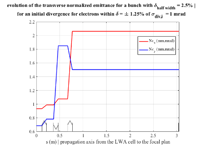

```{r setup, include = FALSE}
library(knitr)
library(tidyverse)
library(nhsrtheme)
library(xaringanExtra)
# set default options
opts_chunk$set(echo = FALSE,
               fig.width = 7.252,
               fig.height = 4,
               dpi = 300)
xaringanExtra::use_panelset()
xaringanExtra::use_broadcast()
xaringanExtra::use_share_again()
xaringanExtra::style_share_again(share_buttons = c("twitter", "linkedin"))
# uncomment the following lines if you want to use the NHS-R theme colours by default
# scale_fill_continuous <- partial(scale_fill_nhs, discrete = FALSE)
# scale_fill_discrete <- partial(scale_fill_nhs, discrete = TRUE)
# scale_colour_continuous <- partial(scale_colour_nhs, discrete = FALSE)
# scale_colour_discrete <- partial(scale_colour_nhs, discrete = TRUE)
```

```{r metathis, echo=FALSE}
library(metathis)
meta() %>%
  meta_description("Presentation of PALLAS project at IN2P3 CS")
  meta_name("github-repo" = "https://kevincassou.github.io/slides/CS-IN2P3/slides/") %>% 
  meta_social(
    title = "PALLAS PROJECT",
    description = paste(
      "laser-plasma accelerator test falicility @ IN2P3"
    ),
    url = "https://kevincassou.github.io/slides/CS-IN2P3/slides/PALLAS-CSI-2021.html",
    image = "https://box.in2p3.fr/index.php/s/pNLLcbYo6EtY8DP/preview",
    image_alt = paste(
      "CNRS/IN2P3/Université Paris-Saclay; IJClab:", 
      "Scale high-quality research data provisioning with R packages,", 
      "presented at AG GDR APPEL IN2P3 2022/05/12 by K. Cassou"
    ),
    og_type = "website",
    og_author = "CNRS/IN2P3/IJClab",
    twitter_card_type = "summary_large_image",
    twitter_creator = "@Cassoukevin",
    twitter_site = "@IJClab"
  )
```

layout: true 

<div class="my-header"></div>

<div class="my-footer">
<span>
 &emsp;
 &emsp; 

| &emsp; IJClab/PALLAS &emsp; | &emsp; AG GDR APPEL &emsp; | &emsp; 2022/05/12 &emsp;  |
&emsp;&emsp;&emsp;&emsp;&emsp;&emsp;&emsp;&emsp;&emsp;&emsp;&emsp;&emsp;&emsp;
&emsp;&emsp;&emsp;&emsp;&emsp;&emsp;&emsp;&emsp;&emsp;&emsp;&emsp;&emsp;
 </span></div>


---
class: title-slide, left, bottom

# `r rmarkdown::metadata$title`
----
## .blue[**`r rmarkdown::metadata$subtitle`**]
### `r rmarkdown::metadata$author`
### `r rmarkdown::metadata$date`

---
class: center, middle

## on behalf ot the team 


.footnote[
Ce document est la propriété d’IJCLab et ne peut être ni reproduit ni diffusé sans autorisation du laboratoire.
This document is written by the IJCLab. It is an IJCLab property and cannot be reproduced or communicated without this authorization.

]


---

# LPA ... key-technology for future e- accelerator?  

### promising technology for future accelerator 

* compactness of the accelerating strucutures  
* multi-GeV machine single or dual stage is the threshold to be competitive respect to RF tech 
* injector or accelerating stages ? maybe both 
  * DESY moonshot
  * any  RF > 150 MeV dedicated to external injection ARES-SINBAD ?
  * AWAKE a CERN-case ... 

### large collection of challenges 

* low energy efficiency
* LPA ... one parameter demonstration performer 
* stability and control still order magnitude under RF conventional machine  
* beam quality 

### European context : EUPRAXIA &  two-tier transition

  * major accelerator labs considered LPA 
  * historical laser lab move from experimental demonstration to source/accelerator reliable operation 


---
name: lpa-in2p3
# Laser-plasma R&D @ IN2P3 ? 

.panelset[
.panel[.panel-name[LASERIX facility]

.pink[**LASERIX**] **40 TW, 10 Hz** laser driver of the .pink[Université Paris Saclay] with unique features in the short term project funded research :

- **Constant maintenance and upgrade** by Université Paris Sud over a more than a decade (~130k€/year + >800k€ investment CPER POLA) 
- Aggregation of unique competencies in a cohesive team
- Localization close to a **radiation shielded area NEPAL** (PHIL) 
- Part of the material to upgrade the laser system to 300 TW<sup>1</sup>, 0.1Hz existing

.center[
```{r echo=FALSE, out.width="25%",fig.pos="!b"}
knitr::include_graphics("img/laserix-system.png")
```
]
.tiny[
[1] Ref. F. Ple et al., "Design and demonstration of a high-energy booster amplifier for a high-repetition rate petawatt class laser system," Opt. Lett. 32, 238-240 (2007)
]

]
.panel[.panel-name[SMILEI numerical platform]

  numerical experimental platform  [](https://smileipic.github.io/Smilei/) &emsp;&emsp;&emsp;  

- High performance / high fidelity  open source PIC-code, recent development bringing unique feature in a super competitive domain of HPC simulation 
.center[
```{r echo=FALSE, out.width="30%"}
knitr::include_graphics("img/smilei.png")
```
]
- Collaboration project : .blue[**VIRTUAL LAPLACE**] gathering the community (LLR,LOA, IJClab) to access to GENCI HPC resources : successful grant on the **A9**, **A11** genci call [A. Beck talk]()
<br>
.tiny[
[ref.] [J. Derouillat *et al.*, ‘Smilei : A collaborative, open-source, multi-purpose particle-in-cell code for plasma simulation’, Computer Physics Communications, vol. 222, pp. 351–373. 2018](https://doi.org/10.1016/j.cpc.2017.09.024) ; [F. Massimo, *et al.*, Phys. Rev. E, vol. 102, no. 3, p. 033204, 2020](https://doi.org/10.1103/PhysRevE.102.033204)

]


]
.panel[.panel-name[Environment]

**+** [ : scientific discussion networking tool for the French LPA community](http://gdr-appel.fr/)

- monthly news
- thematic meeting (target, LPA application to medical sciences, etc.) 

.orange[**+**]  High energy LPA program demonstration experiment lead by A. Specka (LLR) with an access to national multi-PW laser  infrastructure an [LFA](https://apollonlaserfacility.cnrs.fr/salle-longue-focale/) experiment zone. 

.orange[**+**] high regional concentration of world leader laser & photonic industrial companies

.center[&emsp; &emsp; &emsp; &emsp; &emsp; &emsp; &emsp; &emsp;  <br>
&emsp; &emsp; ]
]
]


---
class: inverse, middle center 

# PALLAS project 


---
name: pallas-objectives

# Objectives

Build a laser-plasma **accelerator test facility** aiming to achieve **reliability** and **control** comparable to conventional **RF accelerator** standards.

Push LPA technological development starting with a 10 Hz 150-200 MeV  **laser-plasma injector** (**LPI**) prototype

```{r echo=FALSE, out.width="80%"}
knitr::include_graphics("img/lpi.png")
```

Research and development lines :

1. advanced .red[**laser control**]
2. development of .blue[**plasma targetry**] => plasma cell
3. electron .dgrey[**beam control and transport**]

Achieved fully optimized and controlled LPI  

.center[.orange[**First brick of a more ambitious beamline with second plasma stage (LPAS) or applications**]]


---
name: pallas-parameters

# Electron beam parameters

.pull-left[
Staged effort:  

  - **phase 1** : laser optimization & control, target <br>
  first electron characterization
  
  - **phase 2** : laser and beamline upgrade <br>
  electron beam optimization 
  
  - **phase 3** : transport beamline <br>
  full LPI optimization 
  


.blue[**EuPRAXIA**] parameters for technical design study <sup>1</sup>

**continuous 10 Hz** beam to enable machine studies
]


.pull-right[
<br>

.small[
| Parameters | phase 1 | phase 2 | phase 3 | unit | 
| --:| :--:|:--:|:--:| --:|
| energy  | 150  | **200** | 200 | MeV |
| charge  | 15-30 | **30** | 30 | pC |
| frep | 10 | 10 | 10 | Hz |
| energy spread | <10% | **< 5% ** | < 5% | peak (FWHM) |
| $\varepsilon_{T,n}$  | 1 | **<1** | <1 | mm.mrad |
| stability | 5% | **3%** | **1%** | -  |
| reproductibility | 5% | **3%** | 3% | - | 
]

.small[ Nota bene : **value phase 3** are considered at the virtual entrance of a second laser-plasma accelerating stage.
]

]


.footnote[

[1] R. Assmann, ‘EuPRAXIA Conceptual Design Report’, Hamburg, 2019. [Online]. Available: https://desycloud.desy.de/index.php/s/X37pwaJxEGi2God.
]

---
name: pallas-parameters

# LPI parameters


Configuration of the LPI : laser driver, plasma, ...  
<br>
.center[
.small[
| Parameters | phase 1 | phase 2 | phase 3 | unit | 
| --:| :--:|:--:|:--:| --:|
| laser strengh, $a_0$  | 1.0-1.4  | **>1.8**  | **>1.8** | |
| laser duration, $t_L$  | 40 | **30** | **30** | fs (FWHM) |
| laser waist, $w_0$ | 18 | 18 | 18 | um |
| Strehl ratio, $S_r$ | **> 0.8** | **> 0.8** | **> 0.8** |- |
| beam pointing, $\delta u_i$ | **<0.5** | **<0.5** | **<0.5** | urad
| stability  | 1% | **<1%** | **<1%** | -  |
| frep | 10 | 10 | 10 | Hz |
| target type | multi-cell | multi-cell |  multi-cell | -|
| **injection** | STII | STII  | STII |  - |
| electron beamline | *TBD* | *TBD* | *TBD* | - |
]
]


.footnote[
STII : Self truncated injection / downramp assisted ionization injection to be optimized <br>
TBD : to be defined. 

]


---
name: approach

# Our approach 

**Guidelines**  

- .blue[**Modularity**] : accelerator divided in module 
- .blue[**Reliability**] :  high performances laser optics 
.orange[+] over sized optical compressor (350TW-class grating used @ 40TW) 
.orange[+] optimized laser-driver diagnostic implementation 
- .blue[**Compactness**] : [plasma target](#plasmatargetry2) integrated in the accelerator beamline 
- .blue[**Scalable**] : to high repetition rate (starting in the middle range 10Hz)

--

**Online control (laser / electron)**

-  control command,  webpage based UI
- Full  10 GB/s network acquisition, 10Hz time-stamping, automated data-storage 
- Design oriented for and to ease application of .pink[**Machine Learning**] technics

--

**Stepwise approach (cost / complexity)**

- .qblue[**Staged implementation**] : from the source characterization to more and more complex electron beamline
- .qblue[**Parallel development**] : [plasma cell test bench](#plasmacell) , online laser field control [ML-COLA]()<sup>1</sup> 
- .qblue[**Simulation support**]: reinforce collaboration between experimental and numerical people

.center[ .orange[**Open to the community in the spirit of accelerator development:  OpenHardware / OpenData**]]

.footnote[
ML-COLA: P2IO project (2021-2022), V. Kubytskyi and M. Pittman *Proof of the principle experiment of Machine Learning based online Characterization and Optimisation of a high intensity LAser pulse*.
]s


---

# last progress in simulation SMILEI simulation

<br>
<br>

## Please look to P. Drobniak, V. Kubytsky presentation @ 3rd SMILEI workshop or last GDR PALLAS status.  

[https://indico.math.cnrs.fr/event/6911/timetable/](https://indico.math.cnrs.fr/event/6911/timetable/)


---
class: middle,center,inverse

# Plasma target 


---
name: plasmatargetry1

# Plasma target

### develop engineering of laser-plasma accelerating structure 

**Characteristics length** of a plasma target for LPI ( $10^{18} \leq n_e \leq 10^{19}\,$ cm $^{-3}$ ) :

- Rayleigh length of the laser  &emsp; $\,\rightarrow\,$ &emsp; $Z_r=\pi w_0^2/\lambda_0 \sim 1.3\,$mm
- Plasma wavelength &emsp; &emsp; &emsp; &emsp; $\rightarrow$ &emsp; $\lambda_p \approx 10-30\,\mu m$ 
- Betatron wavelength  &emsp; &emsp; &emsp; $\,\,\,\,\rightarrow$ &emsp; $\lambda_\beta =\sqrt{2\gamma_e}\lambda_p \sim 250-800\,\mu m$ 

**Tailoring plasma density profile**: 

- **.qblue[to control injection]** : density down-ramp assisted truncated ionization injection <sup>1</sup> <br>
$\Rightarrow$ narrowing of the injection length <sup>2</sup>
- **.blue[tune]** the injected **.qblue[charge / beam loading]** <sup>3</sup>
- **tune** e- **.qblue[beam energy]** / acceleration length
- **limit .qblue[emittance growth]** at the exit of the plasma / minimized Twiss parameters  <br> $\Rightarrow$
Control of the exit down ramp is crucial ! <sup>4</sup> 

.center[ .red[**... in only few mm**]  ]

.footnote[
[1] [M. Zeng, et al., Physics of Plasmas, **21**, 3, p. 030701,(2014)](https://doi.org/10.1063/1.4868404).


[2] [J. P. Couperus, et al., , Nat Commun, **8**,1, p. 487,(2017)](https://doi.org/10.1038/s41467-017-00592-7), [3] [P. Lee, et al., Phys. Rev. Accel. Beams, **21**,5, 052802, (2018)](https://doi.org/10.1103/PhysRevAccelBeams.21.052802).

[4] [M. Migliorati, et al., Phys. Rev. ST Accel. Beams, **16**,1, p. 011302, (2013)](https://doi.org/10.1103/PhysRevSTAB.16.011302); [X. Li,et al.,Phys. Rev. Accel. Beams, **22**, 2, p. 021304, (2019)](https://doi.org/10.1103/PhysRevAccelBeams.22.021304).


]

---
name: plasmadensity

# Plasma density profile : an illustration

.left-code[
Example of simulation:  
* LASERIX laser input
* generic shape for .qblue[n<sub>e</sub>(x)] inspired from various ref<sup>1</sup>
* parameter : .black[x<sub>foc,vac</sub>]


mMulti-cell to get access to each region tuning : 

  * length and density  
  * dopant C<sub>N<sub>2</sub></sub>(x) 
  
  
.black[Open ways to:
* Fine optimization 
* Control
* Tolerancing
]

]
.right-plot[

```{r echo=FALSE, out.width="98%",fig.pos="!b"}
knitr::include_graphics("img/fig-cs2.svg")
```
]

.footnote[
[1] [G. Golovin et al., Phys. Rev. ST Accel. Beams,**18**,1,011301,(2015)](https://doi.org/ 10.1103/PhysRevSTAB.18.011301); [M. Mirzaie et al., Sci Rep,**5**,1,14659,(2015)](https://doi.org/10.1038/srep14659).
; [A. Irman et al., Plasma Phys. Control. Fusion, **60**, 4,044015,(2018)](https://doi.org/10.1088/1361-6587/aaaef1), [P. Lee, et al., Phys. Rev. Accel. Beams, **21**,5, 052802, (2018)](https://doi.org/10.1103/PhysRevAccelBeams.21.052802).


]

---
name: LPIsimulation

# Optimization of the LPI core 

.pull-left[
.blue[**Input**] 
* **laser parameters** in vacuum (a<sub>0</sub>,t<sub>0</sub>,w<sub>0</sub>,x<sub>0</sub>) <sup>1</sup>
* .qblue[**plasma target**]:  continuous laminar flow gas cell <br>
$\Rightarrow$ $n_e(x)$  $\propto$ cell geometry + $Q_i$ gas flow

.blue[**Tools:**] 

* **Fast PIC** simulations
  - Azimuthal modes geometry
  - envelope approximation for the laser.  
* **Laminar conductance rough model** for cell geometry as CAD input
* **CFD** [Openfoam](https://www.openfoam.com/) / [snappyHexmesh](https://www.openfoam.com/documentation/guides/latest/doc/guide-meshing-snappyhexmesh.html)  couple to CAD 
* Tracking particle code coupling [ASTRA](https://www.desy.de/~mpyflo/)/CODAL
]
.pull-right[

```{r echo=FALSE, out.width="180%",fig.pos="!b"}
knitr::include_graphics("img/lpi-optimization.svg")
```

]

<br>
.center[.orange[all the ingredient for a **full numerical optimization** of the plasma cell ...]]

.footnote[
[1] in phase 1 : limited to $a_0=1.15\pm0.8$ and $\tau_L = 40\pm3$ fs (FWHM) 

]

---
name: plasmacell

#Plasma cell test bench

.pull-left[
Dedicated test bench for plasma cell: 
-  **fs intense laser driver **   $I \sim 1\times 10^{16}\, W.cm^{-2}$ for plasma channel generation
- **synchronized probe beam** for time resolved transverse interferometry 
- high resolution **plasma density diagnostic** <sup>1</sup> $\delta n_e  < 3 \times 10^{17} cm^{-3}$
- spectral imaging for **dopant spatial distribution control** <sup>2</sup>
- multiple **mass-flow controlled gas injection**
- continuous flow target operation with **two stages differential pumping**

]

.pull-right[

```{r echo=FALSE, out.width="100%"}

```

]


.footnote[
[1] [F. Brandi and L. A. Gizzi, High Pow Laser Sci Eng, vol. 7, p. e26, 2019](https://www.cambridge.org/core/product/identifier/S2095471919000112/type/journal_article); Phasics, ‘SID4 High resolution wavefront sensor, http://phasicscorp.com/cameras/sid4/ (2020).

[2] [B. B. Pollock et al., Phys. Rev. Lett., vol. 107, no. 4, p. 045001, Jul. 2011](https://doi.org/10.1103/PhysRevLett.107.045001).

[3] [K. Wang, PhD, 2019](https://www.theses.fr/2019SACLS179) in ESCULAP project N. Delerue, [E. Baynard et al, NIMA, vol. 909, p.46, 2018](https://doi.org/10.1016/j.nima.2018.03.013).

]

---

# Plasma cell test bench 

.center[
```{r echo=FALSE, out.width="50%"}
knitr::include_graphics("img/testbench-optic-mek-v3.svg")
```
]


---
name: plasmatargetry3

# Plasma target developpement 

.pull-left[
### prototype requirements 

* divide in region / process 
  *  localized dopant 
  * tune independently pressure
* customizable parts (nozzle in, central body , nozzle out) + removable wear parts
* stable density profile ( $\delta n_e < 1$ % ) => continuous flow 
* integrated in the beamline...and compact (*10x6x15* cm<sup>3</sup>)
* transverse optical access for plasma diags

* ...scalability to  high average power operation
]
.pull-right[
```{r echo=FALSE, out.width="100%"}
knitr::include_graphics("img/plasma_channel.jpg")
```
]

---
name: plasmatargetry4

# Plasma target : beamline integration 

* Various configurations exists for plasma target integration : 

```{r echo=FALSE, out.width="100%"}

```


---
name: plasmatargetry4

# Plasma target : beamline integration update

* Local evacuation for high pressure operation light gas operation [Jerome Faure slides IFAST 2022]() and Jens Osterhoff group Bolen _et al._ PRAB 2022 [10.1103/PhysRevAccelBeams.25.031301](https://doi.org/10.1103/PhysRevAccelBeams.25.031301)   : 
<br>
<br>
<br>
.pull-left[
```{r echo=FALSE, out.width="100%"}

```
]

.pull-right[
```{r echo=FALSE, out.width="100%"}

```
]

---
name: plasmatargetry5

# Plasma target  : gas flow

.pull-left[
* In continuous flow, flow rate are typically :  $5 < q_{1,2};q_{6,8} < 15$ mbar.l/s
$$q_i = C_i \times \Delta P$$
* Flow rates depend on cell aperture : $300 < d < 800$ um
$$C_i = f(d_i^n);\quad n\sim 4$$
]

.pull-right[
```{r echo=FALSE, out.width="100%"}
knitr::include_graphics("img/plasmacell-1.png")
```
]


 ### => real conductance are difficult to estimate, fluid simulation are mandatory. 


---
name: plasmatargetrygasflow

# Plasma target  : gas flow

CFD simulation with openfoam [https://www.openfoam.com/](https://www.openfoam.com/), PhD Pierre Drobniak

```{r echo=FALSE, out.width="100%"}

```

=> test of fluid model under validation with experimental data for optimization of outramp [cf. Phi Nghiem talk]

Gas distribution in the beamline with Molflow+ [https://molflow.web.cern.ch/](https://molflow.web.cern.ch/)

---
name: plasmatargetry5

# Plasma target  : gas flow and vacuum

* In continuous flow, flow rate are typically :  $5 < q_{ij} < 15$ mbar.l/s
* Flow rates depend on cell aperture : $300 < d_{ij} < 800$ um
* Match pump pumping speed to pressure stages : 

.center[
```{r echo=FALSE, out.width="60%"}
knitr::include_graphics("img/pumping-speed.png")
```
]


---
name: plasmatargetry6

# Plasma target  : gas flow and vacuum

* First difficulties with the prototype V1 gas confinement in the nozzle, 3-4 mbar plateau in the inner nozzle for 120 mbar pressure in the cell. 
* Common issue with the conductance increase with input aperture 


.center[
```{r echo=FALSE, out.width="30%"}

```
]

* Prototype V1 and new version prototype V2 with better gas evacuation,  PhD Pierre Drobniak

.pull-left[
```{r echo=FALSE, out.width="60%"}

```
]

.pull-right[
```{r echo=FALSE, out.width="60%"}

```

]

---
name:plasmatargetryconfinement

# Ionization injection dopant confinement 

* Confine dopant (N2) in one region for low background electron beam 

* [**PRELIMINARY**] results from spectrally resolved imaging region 1 N2(p_1) He(p_2=20mbar), prototype V1s

.center[
```{r echo=FALSE, out.width="100%"}

```
]

### => successful confinement for pressure equalization 

PhD Pierre Drobniak, MsD Gualadio Kane


---
name:plasmatargetrydensity

# Example of e- density measurement 

* Example of characterization low pressure He (P=5mbar) 

.center[
```{r echo=FALSE, out.width="100%"}

```
]

### tested of electron density diagnostic based wavefront sensor measurement [1]

PhD Pierre Drobniak, MsD Gualadio Kane

.footnote[
[1] Plateau et al.  RSI 2010
]

---
class: middle,center,inverse


# Electron beam control and transport


---
name:eCBL2

# Electron beam line : characterization to control 


.center[
```{r echo=FALSE, out.width="70%"}
knitr::include_graphics("img/lpi-ecbl1.png")
```
]

.pull-left[
### *e-* beam characterization
**Design**: start from PIC simulation parameters <br> **+** explore different capture/focusing scenarii <br>
**Beamline**: magnets with remote alignment <br>
**+** correctors and BPM <br>
**Diags**:  robust diagnostics: Yag screen, faraday cups<br>
**+** wide angular acceptance spectrometer <br> **+**
emittance measurement 

]

.pull-right[
### beam/laser/plasma correlations

* **single shot** characterized **diags** / SNR 
* **online control** laser/plasma/magnets
* machine learning correction 
]

.center[.orange[**+** **additional diagnostic** prevously tested on our photo-injector PHIL for beam duration and **longitudinal phase-space** measurement]]


---
# Electron characterisation line status

Input from SMILEI simulation, analytical home made code and CODAL code 

Try to use electromagnet 10cm long 50T/m for flexibility of the characterisation line

* distance to the first quadrupole : 12cm
* laser removal 100cm from sources 50cm reserved space.
* no diags before laser removal
* up to 5000cm before entrance of direct beam dump
* spectrometer possible position from 200cm - 300cm 

.center[
```{r echo=FALSE, out.width="70%"}

```
]

PhD C. Guyot and C. Bruni  


---
name:ecbl

# Focusing
* For a case with $\sigma_{div,i} \approx 6$ mrad the transverse size is 3.5 mm at the 3rd q quadrupole. 
* Constraint on inner bore radius for the 3rd quad due to laser divergence. 

.pull-left[
```{r echo=FALSE, out.width="90%"}

```
]

.pull-right[
```{r echo=FALSE, out.width="90%"}

```
]

PhD C. Guyot and C. Bruni  

---

# Emittance

* nominal transport with a normalized emittance of $\approx 1$mm.mrad
* even for large energy spread $\approx \pm 2.5$ % normalized emittance is controlled. 

.center[
```{r echo=FALSE, out.width="50%"}

```
]

PhD C. Guyot and C. Bruni  

---

# Emittance vs divergence

For higher divergence the emittance blow up in the first quads compromising the performance, however the focusing enable to work with large divergence range for optimization phase of the LPI.  


.center[
```{r echo=FALSE, out.width="50%"}

```
]


PhD C. Guyot and C. Bruni  

---
# Conclusion : Development plan 


.panelset[
.panel[.panel-name[phase 1]

### 2021-2023:  base of the LPI facility 

* **infrastructure upgrade** : renovation, network, PHIL reconfiguration 

* **laser driver commissioning** :  .blue[laser transport, compression, injection and focalisation]

* **control command development** : .blue[ tango laser gateway +  tango system / DS and GUI for laser transport and injection control + time stamping and automated storage ] 

 .center[.red[** => laser driver optimized **]]
 
* **optimization of plasma injector design / target development **:  PIC simulations optimization studies for injection control and emittance;  target prototyping and testing; plasma module 

 .center[.red[** => target prototype**]]

* **e- characterization beam line**: .blue[ simple characterization beamline : charge,energy,divergence,emittance dE/E ]


 .center[.red[** => first e- beam parameters optimization run at 10Hz.** ]]

]

.panel[.panel-name[phase 2]

### 2023-2024: laser driver and electron beamline upgrade 

* **laser driver upgrade** on target: $\tau_l= 40 \rightarrow 30$ fs, $E_{L,t} = 1.3 \rightarrow 2.5$ J 
  - same amplifier larger Ti:Sa crystal,  one more pump laser<br>
  - ultra broadband Dazzler for high order spectral phase correction 

* **upgrade of electron beamline** : on the base of phase 1 measurements : BPM, focusing section and correctors. 
  
* **beam quality & control optimization studies** $\Rightarrow$ correlation [laser,plasma,electron] $\Rightarrow$ feedback development 

* longitudinal phase space diagnostic development 

* .qblue[electron transport technical design studies] 

.center[.orange[**phase 2 e- beam parameter optimized at 10Hz.**]]

]

.panel[.panel-name[phase 3]

### 2024-2026: e- beam transport 


* installation of the complete electron beam transport line (for staging or application delivery, focused beam)

* installation of the end diagnostic station 

* commissioning and optimization of the **full LPI**

* .qblue[design study for a second laser-plasma accelerating stage]

.center[.orange[**phase 3 LPI operating at 10Hz, beam longitudinal phase space manipulation**]]

]
]


---
class: middle center


# Thanks !  

<br>
<br>

[Contact : ](mailto:cassou@lal.in2p3.fr)

.footnote[
Ce document est la propriété d’IJCLab et ne peut être ni reproduit ni diffusé sans autorisation du laboratoire.
This document is written by the IJCLab. It is an IJCLab property and cannot be reproduced or communicated without this authorization.

]


  
