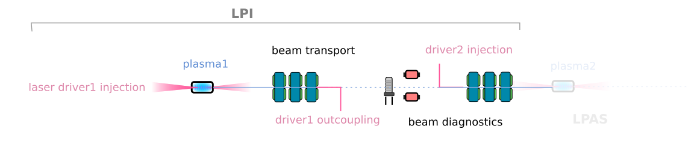
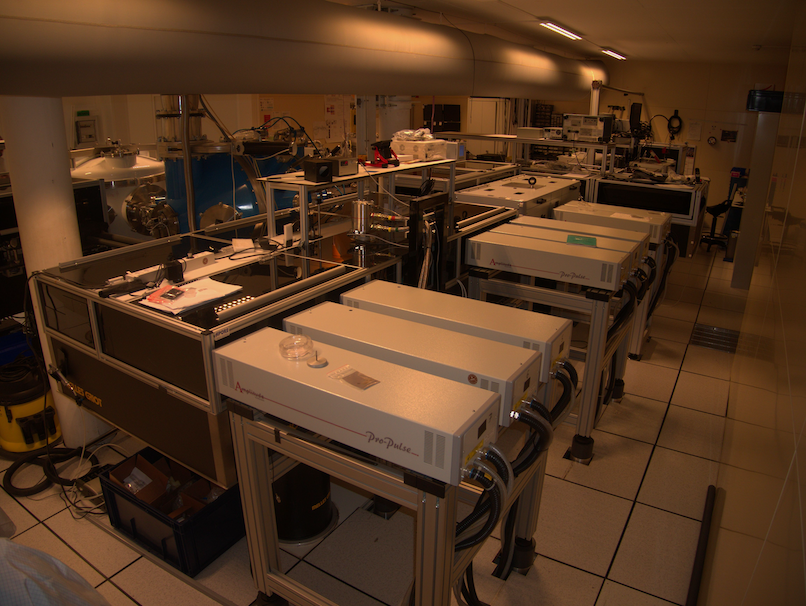
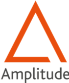
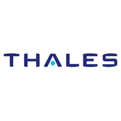
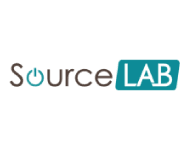
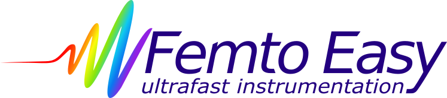

```{r setup, include = FALSE}
library(knitr)
library(tidyverse)
library(nhsrtheme)
library(xaringanExtra)
# set default options
opts_chunk$set(echo = FALSE,
               fig.width = 7.252,
               fig.height = 4,
               dpi = 300)
xaringanExtra::use_panelset()
xaringanExtra::use_broadcast()
xaringanExtra::use_share_again()
xaringanExtra::style_share_again(share_buttons = c("twitter", "linkedin"))
# uncomment the following lines if you want to use the NHS-R theme colours by default
# scale_fill_continuous <- partial(scale_fill_nhs, discrete = FALSE)
# scale_fill_discrete <- partial(scale_fill_nhs, discrete = TRUE)
# scale_colour_continuous <- partial(scale_colour_nhs, discrete = FALSE)
# scale_colour_discrete <- partial(scale_colour_nhs, discrete = TRUE)
```

```{r metathis, echo=FALSE}
library(metathis)
meta() %>%
  meta_description("Presentation of PALLAS project at IN2P3 CS")
  meta_name("github-repo" = "https://kevincassou.github.io/slides/CS-IN2P3/slides/") %>% 
  meta_social(
    title = "PALLAS PROJECT",
    description = paste(
      "laser-plasma accelerator test falicility @ IN2P3"
    ),
    url = "https://kevincassou.github.io/slides/CS-IN2P3/slides/PALLAS-CSI-2021.html",
    image = "https://box.in2p3.fr/index.php/s/pNLLcbYo6EtY8DP/preview",
    image_alt = paste(
      "CNRS/IN2P3/Université Paris-Saclay; IJClab:", 
      "Scale high-quality research data provisioning with R packages,", 
      "presented at Conseil Scientifique IN2P3 2021/02/09 by K. Cassou"
    ),
    og_type = "website",
    og_author = "CNRS/IN2P3/IJClab",
    twitter_card_type = "summary_large_image",
    twitter_creator = "@Cassoukevin",
    twitter_site = "@IJClab"
  )
```

layout: true 

<div class="my-header"></div>

<div class="my-footer">
<span>
 &emsp;
 &emsp; 

| &emsp; IJCLab prospectives &emsp; | &emsp; laser-plasma accelerator &emsp; | &emsp; 2021/04/16 &emsp;  |
&emsp;&emsp;&emsp;&emsp;&emsp;&emsp;&emsp;&emsp;&emsp;&emsp;&emsp;&emsp;&emsp;
&emsp;&emsp;&emsp;&emsp;&emsp;&emsp;&emsp;&emsp;&emsp;&emsp;&emsp;&emsp;
 </span></div>


---
class: title-slide, left, bottom

# `r rmarkdown::metadata$title`
----
## .blue[**`r rmarkdown::metadata$subtitle`**]
### `r rmarkdown::metadata$author`
### `r rmarkdown::metadata$date`

---
class: center, middle

## on behalf ot the team 


.footnote[
Ce document est la propriété d’IJCLab et ne peut être ni reproduit ni diffusé sans autorisation du laboratoire.
This document is written by the IJCLab. It is an IJCLab property and cannot be reproduced or communicated without this authorization.

]


---

# Plasma wakefield accelerator 

High energy physics and photon sciences require 
 - higher beam energy  $\rightarrow$ increase accelerating gradient
 - lower cost $\rightarrow$     decrease machine footprint 
 - ... and high efficiency 
 
.blue[**A solution: plasma wakefield accelerator**]

--
.pull-left[

**.orange[beam-driven]**:

- most advanced  
- high repetition rate 
- high efficiency
- see *next step and challenges* by presentation  J. Osterhoff at the [Town Hall Meeting for High gradient acceleration](https://indico.cern.ch/event/1017117/contributions/4290156/attachments/2218423/3756194/2021-03-30%20Zoom%20PA%20Townhall.pdf) (2021/03/30) 

]

--

.pull-right[
**.qblue[laser-driven]**:

- compact   
- driver-limited repetition rate but ongoing project (KALDERA, LAPLACE-HR)
- laser revolution is required for plugwall  efficiency (0.1% $\rightarrow$ >60%)
- see C. Schroeder LPA overview for HEP at the [Town Hall Meeting for High gradient acceleration](https://indico.cern.ch/event/1017117/contributions/4290155/attachments/2218413/3756166/2021mar30_Townhall_Schroeder-LWFA.pdf) (2021/03/30)
]

look to [https://indico.cern.ch/event/1017117/](https://indico.cern.ch/event/1017117/)
<br>
<br>
.center[ .blue[  **laser-driven approach at IN2P3/IJCab** ]]


---
name: strategy 

# ESPPU view 

* [*2020 Update of European Strategy for Particle Physic*, preamble p. 8](https://cds.cern.ch/record/2721370/files/CERN-ESU-015-2020%20Update%20European%20Strategy.pdf) : 
.small[
  >Innovative accelerator technology underpins the physics reach of high-energy and high-intensity colliders. It is also a powerful driver for many accelerator-based fields of science and industry. **The technologies under consideration include** high-field magnets, high-temperature superconductors, **plasma wakefield acceleration** and other high-gradient accelerating structures, bright muon beams, energy recovery linacs. The European particle physics community **must intensify accelerator R&D and sustain it with adequate resources**. A roadmap should **prioritise the technology**, taking into account synergies with international partners and other communities such as photon and neutron sources, fusion energy and industry. Deliverables for this decade should be defined in a timely fashion and coordinated among CERN and national laboratories and institutes.
]

* Numerous laser-plasma experimental campaign proof of principle but the road is long to 3 TeV collider ... century's gap ? 

* **First step in next 5 years build laser-plasma accelerator** able to produce e- beam with **stability and reliability** comparable to **standard RF** room temperature accelerator ...   


* .orange[**Transition from proof of principle to accelerator technology is necessary**]
  * R&D on laser-plasma accelerator technology : demonstrator / laser-plasma accelerator test-facility  
  * R&D on laser driver : industrial development toward kW laser system 


---

# LPA state of the art 

LPA a .orange[**one**] parameter optimization performer 

.center[
```{r echo=FALSE, out.width="90%"}
knitr::include_graphics("img/stateoftheart-lpa.png")
```
]

.small[*Note : all experimental demonstration in single stage LPA *]


---
name: challenges

# Challenges for laser-driven plasma accelerator

### **.orange[beam quality, stabilty and control] ...**

* **laser control** : sub-percent level control ( $E_L^2$ , $\tau_L$, $\phi(x,y)$ ...) and spatio-temporal properties online monitoring    

* **plasma targetry** : longitudinal tailored plasma target, in beamline integration, $>10$ cm long hollow plasma channel for high energy accelerating stage
  * define technological configuration (standards?)
  * scalable to high repetition rate

* **high performances** / **high fidelity** **.qblue[simulations tools]** : huge parameter space for optimization  / complex interplay nonlinear process  

* **in/out beam coupling** :  for staging very strong focusing forces in the plasma $\beta\leq 0.1$ + injection/ejection of the driver 

### **...dedicated test facility **

---
name: pallas-nutshell

# PALLAS project in a nutshell 


.pull-left[
```{r echo=FALSE, out.width="110%"}

```

**Staged efforts**:
1. advanced .red[**laser control**]
2. development of .blue[**plasma targetry**] => plasma cell
3. electron .dgrey[**beam control and transport**]

.qblue[**continuous 10 Hz**] operation to enable machine studies

.orange[**openData**]: 
- push for reproducibility simulations and exp./ 
- encourage common definition of standards 
]


.pull-right[

.blue[**EuPRAXIA**] parameters technical design study <sup>1</sup>
.small[
| Parameters | phase 1 | phase 2 | phase 3 | unit | 
| --:| :--:|:--:|:--:| --:|
| energy  | 150  | **200** | 200 | MeV |
| charge  | 15-30 | **30** | 30 | pC |
| frep | 10 | 10 | 10 | Hz |
| energy spread | <10% | **< 5% ** | < 5% | peak (FWHM) |
| $\varepsilon_{T,n}$  | 1 | **<1** | <1 | mm.mrad |
| stability | 5% | **3%** | **1%** | -  |
| reproductibility | 5% | **3%** | 3% | - | 
]

.small[ Nota bene : **value phase 3** are considered at the virtual entrance of a second laser-plasma accelerating stage.
]


]


.footnote[

[0] more details on PALLAS project : CSI 20210208 slides [https://s.42l.fr/pallas](https://s.42l.fr/pallas)

[1] R. Assmann, ‘EuPRAXIA Conceptual Design Report’, Hamburg, 2019. [Online]. Available: https://desycloud.desy.de/index.php/s/X37pwaJxEGi2God.
]


---
# Development plan 


.panelset[
.panel[.panel-name[phase 1]

### 2020-2022:  base of the LPI facility 

* **infrastructure upgrade** : renovation, network, NEPAL reconfiguration 

* **laser driver commissioning** :  .blue[laser transport from LASERIX, compression, injection and focalisation]

* **control command development** : .blue[ tango laser gateway +  tango system / DS and GUI for laser transport and injection control + time stamping and automated storage ] 

 .center[.red[** => laser driver optimized **]]
 
* **optimization of plasma injector design / target development **:  PIC simulations optimization studies for injection control and emittance;  target prototyping and testing; plasma module 

 .center[.red[** => target prototype**]]

* **e- characterization beam line**: .blue[ simple characterization beamline : charge,energy,divergence,emittance dE/E ]


 .center[.red[** => first e- beam parameters optimization run at 10Hz.** ]]

]

.panel[.panel-name[phase 2]

### 2023-2024: LASERIX laser driver and electron beamline upgrade 

* **laser driver upgrade** on target: $\tau_l= 40 \rightarrow 30$ fs, $E_{L,t} = 1.3 \rightarrow 2.5$ J 
  - same amplifier larger Ti:Sa crystal,  one more pump laser<br>
  - ultra broadband Dazzler for high order spectral phase correction 

* **upgrade of electron beamline** : on the base of phase 1 measurements : BPM, focusing section and correctors. 
  
* **beam quality & control optimization studies** $\Rightarrow$ correlation [laser,plasma,electron] $\Rightarrow$ feedback development 

* longitudinal phase space diagnostic development 

* .qblue[electron transport technical design studies] 

.center[.orange[**phase 2 e- beam parameter optimized at 10Hz.**]]

]

.panel[.panel-name[phase 3]

### 2024-2026: e- beam transport 


* installation of the complete electron beam transport line (for staging or application delivery, focused beam)

* installation of the end diagnostic station 

* commissioning and optimization of the **full LPI**

* .qblue[design study for a second laser-plasma accelerating stage]

.center[.orange[**phase 3 LPI operating at 10Hz, beam longitudinal phase space manipulation**]]

]
]


---
name: summary

# Summary


* Unique opportunities to build a **10Hz laser-plasma accelerator test facility** with an exciting program for the next 5 years.   

* **Push back the laser-plasma technology frontiers** to high reliability and control  

* **Complementary** to national effort at CNRS-INP (LAPLACE, ApoLLon) in the **EuPRAXIA context**  

* **@IJClab** building machines in the house and compete with other *"large laboratories"* is possible only if we are able to reinforce essential technical services.  

* **@IN2P3** :  Reinforce competences and position in future innovative accelerator technologies

 **Requirement for IN2P3** : a strong financial support of >564 k€ over 2022-2025 is required to the IN2P3 + 2 post-doc and doc positions. Laser-plasma group at IN2P3 must be reinforced with numerician/physicist position specialist in laser-plasma accelerator.

* for future plan to **GeV energy beam** by adding a plasma stage :
  - technical design would be required by 2024 to start the staging project in 2027
  - important needs in infrastructure, resources and budget


---
class: inverse, middle center
background-image: url(img/plasmacell.jpg)
background-size: cover


<br>
<br>
<br>
<br>
<br>
<br>
#   &emsp; &emsp; Thanks !  


.footnote[
Ce document est la propriété d’IJCLab et ne peut être ni reproduit ni diffusé sans autorisation du laboratoire.
This document is written by the IJCLab. It is an IJCLab property and cannot be reproduced or communicated without this authorization.

]

---
class: inverse, middle, center

# Back slides


---
name: pallas-parameters

# LPI parameters


Configuration of the LPI : laser driver, plasma, ...  
<br>
.center[
.small[
| Parameters | phase 1 | phase 2 | phase 3 | unit | 
| --:| :--:|:--:|:--:| --:|
| laser strengh, $a_0$  | 1.15  | **1.97**  | **1.97** | |
| laser duration, $t_L$  | 40 | **30** | **30** | fs (FWHM) |
| laser waist, $w_0$ | 18 | 18 | 18 | um |
| Strehl ratio, $S_r$ | **> 0.8** | **> 0.8** | **> 0.8** |- |
| beam pointing, $\delta u_i$ | **<0.5** | **<0.5** | **<0.5** | urad
| stability  | 1% | **<1%** | **<1%** | -  |
| frep | 10 | 10 | 10 | Hz |
| target type | multi-cell | multi-cell |  multi-cell | -|
| **injection** | STII | STII  | STII |  - |
| electron beamline | *TBD* | *TBD* | *TBD* | - |
]
]


.footnote[
STII : Self truncated injection / downramp assisted ionization injection to be optimized <br>
TBD : to be defined. 

]

  

---
name: lpa-in2p3
# Laser-plasma R&D @ IN2P3 ? 

.panelset[
.panel[.panel-name[LASERIX facility]

.pink[**LASERIX**] **40 TW, 10 Hz** laser driver of the .pink[Université Paris Saclay] with unique features in the short term project funded research :

- **Constant maintenance and upgrade** by Université Paris Sud over a more than a decade (~130k€/year + >800k€ investment CPER POLA) 
- Aggregation of unique competencies in a cohesive team
- Localization close to a **radiation shielded area NEPAL** (PHIL) 
- Part of the material to upgrade the laser system to 300 TW<sup>1</sup>, 0.1Hz existing

.center[
```{r echo=FALSE, out.width="25%",fig.pos="!b"}

```
]
.tiny[
[1] Ref. F. Ple et al., "Design and demonstration of a high-energy booster amplifier for a high-repetition rate petawatt class laser system," Opt. Lett. 32, 238-240 (2007)
]

]
.panel[.panel-name[SMILEI numerical platform]

  numerical experimental platform  [](https://smileipic.github.io/Smilei/) &emsp;&emsp;&emsp;  

- High performance / high fidelity  open source PIC-code, recent development bringing unique feature in a super competitive domain of HPC simulation 
.center[
```{r echo=FALSE, out.width="30%"}
knitr::include_graphics("img/smilei.png")
```
]
- Collaboration project : .blue[**VIRTUAL LAPLACE**] gathering the community (LLR,LOA, IJClab) to access to GENCI HPC resources : successful grant on the **A9** genci call. 
<br>
.tiny[
[ref.] [J. Derouillat *et al.*, ‘Smilei : A collaborative, open-source, multi-purpose particle-in-cell code for plasma simulation’, Computer Physics Communications, vol. 222, pp. 351–373. 2018](https://doi.org/10.1016/j.cpc.2017.09.024) ; [F. Massimo, *et al.*, Phys. Rev. E, vol. 102, no. 3, p. 033204, 2020](https://doi.org/10.1103/PhysRevE.102.033204)

]


]
.panel[.panel-name[Environment]

**+** [ : scientific discussion networking tool for the French LPA community](http://gdr-appel.fr/)

- monthly news
- thematic meeting (target, LPA application to medical sciences, etc.) 

.orange[**+**]  access to national multi-PW laser  infrastructure an [LFA](https://apollonlaserfacility.cnrs.fr/salle-longue-focale/) experiment zone

.orange[**+**] high regional concentration of world leader laser & photonic industrial companies

.center[&emsp; &emsp; &emsp; &emsp; &emsp; &emsp; &emsp; &emsp;  <br>
&emsp; &emsp; ]
]
]


  
